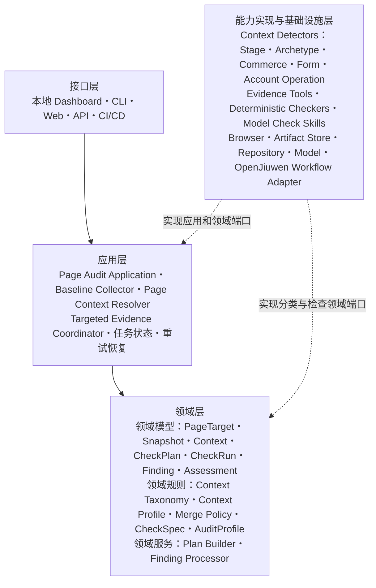
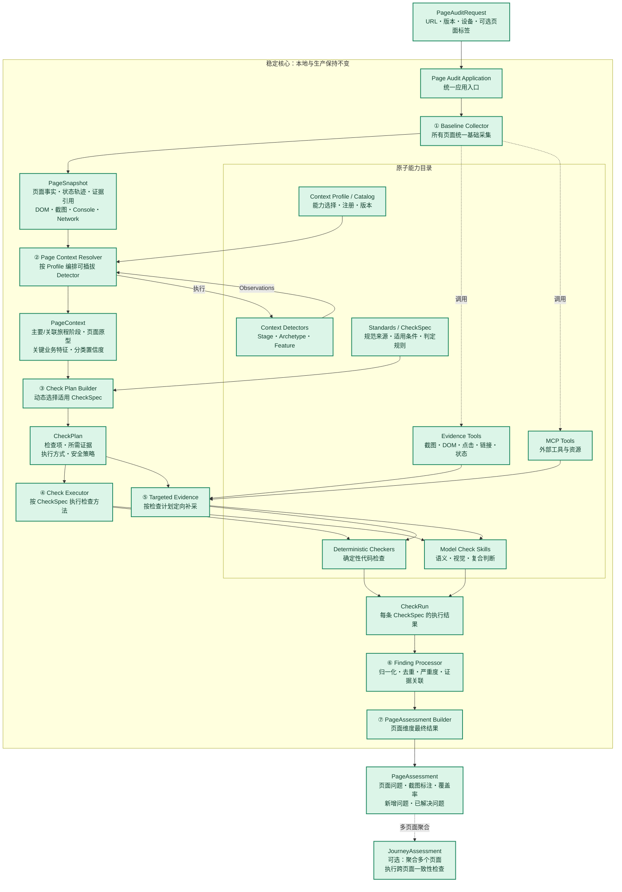
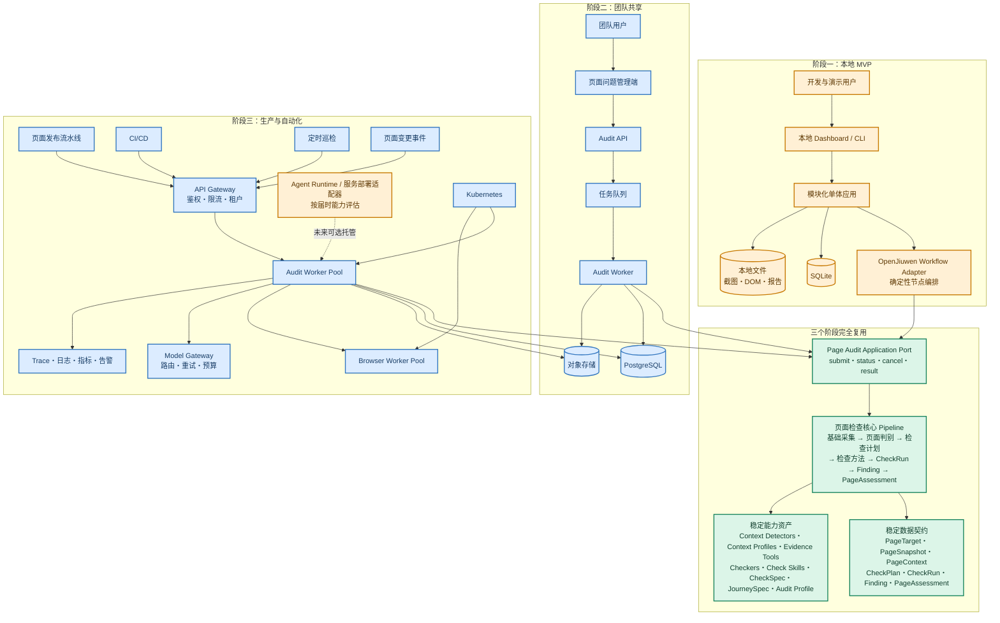

# 页面驱动的体验检查平台架构方案

> 状态：MVP 架构基线  
> 日期：2026-08-17（2026-08-24 更新 MVP 决策）  
> 适用项目：`portal_experience_check`  
> 目标：先使用 OpenJiuwen Python SDK 完成本地 MVP，再逐步演进为团队共享和生产服务，同时保持核心检查架构与数据契约稳定。

## 1. 执行摘要

本方案将当前以“完整用户旅程 + 大型 Skill”为中心的检查方式，调整为以页面为中心的动态检查架构：

1. 输入任意页面后，首先执行所有页面通用的基础采集，包括 DOM、截图、可访问性语义、交互元素、页面状态、安全交互轨迹、链接去向、Console 错误和失败请求。
2. 根据显式参数、页面注册信息和可插拔 Context Detectors，建立页面上下文，识别主要/关联旅程阶段、页面原型和影响规则选择的关键业务特征；渠道、设备、语言和身份由 `PageTarget` 提供。
3. 根据页面上下文动态生成 `CheckPlan`，选择当前页面适用的 `CheckSpec`，并计算所需证据和执行方式。
4. 每条 `CheckSpec` 由确定性检查器或模型型 Check Skill 执行。模型 Skill 仍是独立、版本化的能力资产，但可由 `CheckPlan` 按语义域合并为少量模型调用；无论调用拓扑如何，每条规则都必须产生独立 `CheckRun`，再归一化为 `Finding` 并聚合为页面维度的 `PageAssessment`。
5. 用户旅程不再是所有检查的强制入口，而是页面的上下文和跨页面聚合维度；单页面可以独立检查，只有跨页面规则需要读取或补采其他页面证据。
6. OpenJiuwen Workflow、Agent Runtime、Web/API、数据库和部署环境均位于核心检查架构之外，通过稳定端口接入。先本地后生产时，主要替换外围适配器和基础设施，不重写页面检查核心。

核心架构原则为：

> Thin Skill，Fat Audit Engine。入口和编排框架可替换，页面检查内核、能力契约和结果契约保持稳定。

## 2. 背景与问题

当前 `cloud-customer-journey` Skill 同时承担：

- 七阶段旅程导航；
- 登录态处理和 Playwright 操作；
- DOM、截图和页面状态证据采集；
- 阶段级模型分析；
- 六类父级检查和二十二个详细检查项；
- 跨阶段一致性核对；
- 覆盖率校验、问题合并和报告生成。

这种实现能够完成端到端走查，但存在以下架构问题：

- 检查入口被绑定为完整旅程，单页面发布后难以低成本触发定向检查；
- 采集、判别、规则选择、模型判断和报告生成耦合在一个大型 Skill 中；
- 检查项和阶段是主要输出组织方式，难以形成管理者需要的页面问题视图；
- 中间结果依赖当前 Agent 会话和文件 handoff，服务化和无人值守运行成本较高；
- 不同页面需要的规则不同，但当前主要通过统一 Prompt 要求所有阶段返回固定检查项；
- 本地运行方式、未来生产编排框架和领域逻辑之间缺少清晰边界。

## 3. 目标与非目标

### 3.1 目标

- 任意页面均可独立触发检查。
- 页面基础证据采集方式统一。
- 根据页面上下文动态选择检查能力，不要求所有页面执行同一组规则。
- 页面上下文识别能力按业务维度或特征族原子化，可通过 Context Profile 插拔和版本锁定。
- 同一检查能力可以被不同页面类型和旅程场景复用。
- 输出以 `PageAssessment` 为主，支持按页面查看潜在问题、截图、证据和版本变化。
- 本地 Dashboard/CLI、团队 API、CI/CD 等入口使用同一核心应用端口。
- 本地到生产只替换适配器和基础设施，不改变核心领域模型、检查计划和结果契约。

### 3.2 非目标

- 第一阶段不追求一次完成全部生产能力。
- 第一阶段不将系统拆分为多个微服务。
- 不让 Agent 自由决定高风险浏览器操作。
- 不把用户旅程完全删除；旅程继续负责跨页面关系、阶段覆盖和一致性检查。
- 不要求第一阶段直接接入 Agent Runtime。

## 4. 核心架构决策

### 4.1 页面是主要检查对象

页面拥有稳定的 `page_id`，URL 只是页面一次访问的属性。页面可以：

- 独立执行检查；
- 关联一个或多个旅程阶段；
- 在不同设备、语言、地区、登录身份和发布版本下产生不同 `PageSnapshot`；
- 参与跨页面一致性检查。

### 4.2 采用两阶段证据采集

第一轮只执行所有页面通用、安全且成本可控的基础采集；完成页面分类和检查计划后，再根据规则需求执行定向补采。避免所有页面都穷举全部点击和状态。

### 4.3 页面类型采用多维标签

页面不是单一的 A、B、C 类型。检查上下文由两类信息共同组成：

- `PageTarget` 事实：渠道、设备、语言、站点和用户身份；
- `PageContext` 业务标签：主要/关联旅程阶段、页面原型，以及价格、购买入口、表单、订阅和破坏性操作等关键业务特征。

规则通过适用条件组合匹配 Target 事实和 Context 标签，从而避免页面类型组合爆炸。业务特征只表达页面“具有什么”，不表达“做得是否合格”；体验质量仍由 CheckSpec 判断。

### 4.4 检查规则与检查方法必须分离

- Standard 是检查规则的规范来源，例如公司体验规范、设计系统和法规要求。
- `CheckSpec` 是版本化的领域规则，定义规则身份、适用条件、证据要求、判定标准、严重度策略和规范引用，回答“检查什么、怎样算有问题”。
- Deterministic Checker 是 `CheckSpec` 的确定性执行方式，适合使用代码准确判断的规则，例如 H1 数量、链接状态、元素尺寸和 Console 错误。
- Model Check Skill 是 `CheckSpec` 的模型型执行方式，适合语义、视觉和复合判断，回答“如何利用证据完成判断”。
- Evidence Tool 负责产生事实和证据，不直接判断问题；MCP 是暴露 Tool 或外部资源的协议，不是领域规则。
- 当前 MVP 每条 `CheckSpec` 必须且只能指定一个执行器。一个 Checker 或 Check Skill 可以复用于多条相关 `CheckSpec`，但必须为每条规则分别产生 `CheckRun`；未来若允许同一规则配置多个执行器，必须先定义冲突合并策略并升级契约。
- 执行批次不是新的规则层。`ExecutionBatch` 只描述一次计划如何调用能力，不能改变 CheckSpec 的适用条件、严重度或逐规则输出契约。

因此，Check Skill 与 Rule 不是两套平行规则：业务规则统一沉淀为 `CheckSpec`，Skill 只是执行这些规则的一种方法。不为每条规则机械创建一个 Skill。

| 概念 | 回答的问题 | DDD 定位 |
|---|---|---|
| Standard | 规则依据来自哪里 | 领域知识来源 |
| CheckSpec | 检查什么、何时适用、怎样算有问题 | 版本化领域规则 |
| Deterministic Checker | 如何用确定性代码执行规则 | 检查能力实现，遵循领域端口 |
| Model Check Skill | 如何用语义、视觉或复合推理执行规则 | 检查能力实现，遵循领域端口 |
| Evidence Tool / MCP | 如何获得事实证据 | 基础设施能力 |
| CheckRun | 某条规则本次执行结果是什么 | 版本化领域事实 |

### 4.5 DDD 分层总览



依赖原则是：接口层调用应用层，应用层编排领域能力；领域层不依赖 OpenJiuwen、MCP、浏览器、模型 SDK 或部署框架。基础设施和检查能力通过稳定端口实现领域需要的证据采集与规则执行。

### 4.6 PageAssessment 是页面查询投影

底层保留全部 `Finding`、`CheckRun`、证据和规则引用，但面向管理者默认呈现：

- 页面当前潜在问题；
- P0/P1/P2 数量；
- 页面截图和元素标注；
- 新增、持续和已解决问题；
- 影响的旅程阶段；
- 覆盖不足和待验证项。

检查项视图保留为方法溯源和质量控制视图，不作为默认业务报告。

每次成功完成的运行生成三种标准输出：机器可读的 `audit.json`、物化后的 `checkplan.json` 和可独立打开的 `report.html`。当前模型 HTTP/超时失败可能在持久化前终止 Workflow，因此失败运行尚不保证生成三件套。输出样式与字段兼容性以当前已验证的 Token Plan 产物为准：

- `output/web/tokenplan/awareness/desktop/zh-CN/{run-id}/audit.json`；
- `output/web/tokenplan/purchase/desktop/zh-CN/{run-id}/checkplan.json`；
- `output/web/tokenplan/purchase/mobile/zh-CN/{run-id}/report.html`。

单页运行目录必须保留 `product`、稳定语义化 `page_id`、`device` 和 `locale` 四个辨识维度，不能再把同一产品的感知页、购买页或 Desktop/Mobile 结果直接混放在产品目录下。历史产物继续保留，但新运行统一使用 `output/{source}/{product}/{page_id}/{device}/{locale}/{run_id}`。

单 URL 检查先解析 `page_surface` 再展开变体。`portal` 的展示语言由 URL 决定，默认只展开 `devices=[desktop,mobile]`；国际站必须提供真实的 `/intl/en-us/` URL，不根据浏览器 Locale 构造伪英文页面。`console` 默认展开 `device=[desktop] × locales=[zh-CN,en-US]`，不执行移动端检查。调用方显式提供 `device`、`locale` 或 `page_surface` 时作为覆盖条件；每个实际变体必须独立采集和执行，不能跨设备或跨语言复用 Snapshot。

保留现有报告中的问题汇总、优先处理清单、截图定位、详细检查和完整问题清单，但默认详情组织从“阶段/检查项”调整为“页面”。`Finding` 和 `CheckRun` 各只完整序列化一次，`PageAssessment` 与轻量 `sections` 通过 ID 引用它们；`stage_analysis` 和 `cross_stage_checks` 只在 Journey Run 中生成。`checkplan.json` 是本次计划的独立物化结果，便于回放、比较和调试；`audit.json` 仍保留同一计划的内嵌投影，保证单文件消费者可用。完整输出契约见 `docs/0821/local-mvp-detailed-design.md` 第 10 节。

## 5. 稳定的页面检查核心

下图中的所有组件在本地、团队共享和生产阶段保持不变。



### 5.1 基础采集

#### 5.1.1 定义与职责边界

`Baseline Collector` 是应用层的通用采集编排模块：在尚不知道页面具体类型、也不执行体验规则判断的情况下，使用统一、安全、有限的方式采集足以描述页面和支持上下文判别的基础事实。

```text
Page Audit Application
        ↓
Baseline Collector
        ├── 应用 Baseline Capture Policy
        ├── 调用 Evidence Tools / MCP
        ├── 控制浏览器会话、安全交互和采集预算
        ├── 保存 DOM、截图、Network 等 Artifact
        └── 组装 PageSnapshot 与 BaselineCaptureResult
```

职责划分如下：

| 概念 | 职责 |
|---|---|
| Baseline Collector | 编排一次通用基础采集，处理预算、状态和部分失败 |
| Evidence Tool | 执行一个具体采集动作，例如截图、提取 DOM、读取 Console |
| PageSnapshot | 保存某个页面目标在特定时刻观察到的版本化事实和证据引用 |
| Page Context Resolver | 基于 Snapshot 和 Context Profile 编排可插拔 Detector，判断旅程阶段、页面原型和关键业务特征 |
| Checker / Check Skill | 基于 CheckSpec 和证据判断页面是否满足规则 |

Baseline Collector 只回答“页面上观察到了什么”，不负责页面分类、CheckSpec 选择、体验判断、严重度计算或 Finding 生成。

基础证据不得通过元素数、正文字符数、图片数或事实数的固定前缀上限静默裁剪。采集或传输必须分批完成；如果某类证据因异常未完整采集，Snapshot/Projection 必须显式标记覆盖不完整，依赖它的 CheckSpec 不能判定为通过。

#### 5.1.2 输入契约

Baseline Collector 的输入不是裸 URL，而是 `PageTarget`、调用上下文和版本化采集策略：

```yaml
BaselineCaptureRequest:
  audit_id: audit-001
  target:
    page_id: product-modelarts
    url: https://example.com/product/modelarts
    build_id: build-20260817
    device_profile: desktop-chrome
    locale: zh-CN
    persona: anonymous
    source_context:
      source_url: https://example.com/products
      journey_id: optional
      journey_stage: awareness

  policy:
    policy_version: baseline-v1
    interaction_level: safe
    max_duration_seconds: 120
    max_actions: 10
    max_page_states: 5
    capture_fullpage: true
    collect_network: true
    collect_console: true

  authentication:
    profile_id: optional
```

同一个逻辑页面的 Desktop 和 Mobile Web 应作为两个独立 `PageTarget` 执行，分别产生 Snapshot；不能使用桌面端证据推断移动端体验。登录流程由 Authentication Adapter 在采集前准备，Baseline Collector 只消费已经准备好的浏览器身份，不把登录编排混入每个页面的基础采集。

当前 `iphone-web-v1` Profile 使用 390×844 CSS px、3x DPR、Touch 和版本化 iPhone User-Agent 常量采集独立 Snapshot。除通用证据外，还产生逻辑证据 `mobile_layout`，并落盘为 `artifacts/mobile-layout.json`；该证据记录文档宽度与排除轮播/显式横向滚动容器后的溢出元素。触控目标尺寸复用交互元素 bounds；设备专属 CheckSpec 通过 `applies_when.devices: [mobile]` 进入计划，Desktop 不执行这些规则。

#### 5.1.3 内部处理步骤

Baseline Collector 在逻辑上包含以下职责；第一版可以保持为模块化单体内部组件，不必拆成独立服务：

1. **Target Resolver**：规范化 URL、设备、Viewport、语言、身份和安全策略。
2. **Navigation Collector**：访问页面并记录最终 URL、重定向、状态码、Canonical、Referrer、标题、语言和阻断状态。
3. **Initial State Collector**：采集初始 DOM、Accessibility Tree、截图、可见内容和页面几何信息。
4. **Element Inventory Collector**：建立链接、按钮、Tab、表单、下拉菜单和其他交互元素清单。
5. **Safe State Explorer**：在动作数、状态数、深度和时间预算内探索低风险、可逆的页面内状态。
6. **Runtime Diagnostics Collector**：收集 Console 错误、失败请求和必要的加载诊断信息。
7. **Snapshot Assembler**：执行脱敏和质量检查，保存 Artifact，组装不可变 `PageSnapshot` 和采集结果包络。

#### 5.1.4 通用基础证据

所有页面统一采集相同的证据类别，但具体设备参数由 `PageTarget` 决定：

| 证据类别 | 基础采集内容 |
|---|---|
| 导航事实 | 请求 URL、最终 URL、重定向链、状态码、Canonical、Referrer、标题、语言 |
| 执行环境 | 设备、Viewport、浏览器、语言、时区、Persona、采集版本 |
| 页面结构 | DOM、清洗后的结构化 HTML、Accessibility Tree、标题层级、Landmark、iframe 摘要 |
| 视觉证据 | Viewport 截图、全页截图、页面尺寸、固定元素和可见遮挡 |
| 内容投影 | 可见文字、标题、价格、说明、提示、按钮、链接和表单，不包含体验结论 |
| 交互清单 | 元素角色、文案、位置、尺寸、可见性、启用状态、候选定位器和潜在动作风险 |
| 页面关系 | 可见出口、链接目标以及调用方提供的入口、发布版本和旅程上下文 |
| 运行诊断 | Console error/warning、未捕获异常、失败请求、超时和关键资源错误 |
| 安全状态 | Tab、手风琴、菜单和可逆 Modal 等有限页面内状态及其状态变化 |

页面来源通常不能仅从当前页面可靠推断，应按以下来源组合：调用方传入的 `source_context`、真实 Referrer、页面注册表、Journey Graph 或历史爬取关系。Baseline Collector 只记录这些来源及其证据，不自行虚构完整用户旅程。

Network 和 Console 证据必须经过脱敏。默认不持久化 Token、Cookie、Authorization Header、表单内容、完整用户数据或无必要的响应正文。

#### 5.1.5 安全交互策略

Baseline 可以执行少量低风险、可逆、不提交数据的页面内交互：

- 展开 Tab、Accordion、下拉菜单和 Hover 导航；
- 打开后能够安全关闭的说明 Modal；
- 切换轮播内容；
- 关闭 Cookie 或非业务遮挡弹窗；
- 读取普通链接的 `href` 或路由信息，而不实际完成导航。

Baseline 默认禁止：

- 登录、发送验证码、上传文件和提交表单；
- 创建订单、确认购买、支付和勾选商业协议后继续；
- 删除、退订、释放资源或修改账号配置；
- 穷举访问所有链接、递归遍历页面状态或执行模型自由决定的高风险动作。

例如“立即购买”按钮在 Baseline 阶段只采集文案、位置、可见性、链接或路由信息，并标记为商业导航风险；只有 CheckPlan 明确需要验证购买去向时，才进入 Targeted Evidence。

#### 5.1.6 页面状态与采集轨迹

一个页面可以产生多个安全状态，不能用后续状态覆盖初始页面事实：

```text
BaselineCapture
├── PageSnapshot：initial
├── ObservedState：pricing-tab-opened
├── ObservedState：faq-accordion-opened
└── CaptureTrace：动作、前后状态、耗时和结果
```

第一版建议限制 `max_actions = 10`、`max_page_states = 5`、`max_depth = 1` 和总时长 120 秒。后续可根据真实页面成本调整，不允许无限探索。

#### 5.1.7 输出与部分成功语义

Baseline Collector 返回采集结果包络，而不只返回一个裸 Snapshot：

```yaml
BaselineCaptureResult:
  capture_id: capture-001
  status: partial_success
  page_snapshot:
    snapshot_id: snapshot-001
    page_target_id: target-001
    initial_state_id: initial
    artifact_manifest_ref: artifact://manifest/001
  evidence_coverage:
    navigation: complete
    dom: complete
    screenshot: complete
    accessibility_tree: complete
    interactive_elements: complete
    console: complete
    network: partial
    safe_states: partial
  warnings:
    - code: NETWORK_CAPTURE_INCOMPLETE
      message: 页面存在持续长连接，网络采集在超时后结束
  failures: []
  provenance:
    collector_version: baseline-collector@1.0.0
    policy_version: baseline-policy@1.0.0
```

状态语义：

- `success`：页面已渲染，并获得最低要求的导航、结构、截图和交互证据。
- `partial_success`：部分非关键证据缺失，例如全页截图、Accessibility Tree、Network 或安全状态采集失败；允许继续分类和执行证据充足的检查。
- `failed`：浏览器无法启动、页面完全无法访问、被登录或验证码完全阻断，或者 DOM、截图和 Accessibility Tree 均不可用。

采集成功不等于页面正常。成功采集到 404、业务错误页或空状态页时，Baseline 状态仍可以是 `success`，具体问题由后续 CheckSpec 判断。后续模块不得把证据缺失或采集错误视为规则通过。

#### 5.1.8 与 Targeted Evidence 的边界

判断原则是：不知道页面类型时也大概率需要、风险低且可被多个规则复用的证据进入 Baseline；只有部分页面或 CheckSpec 需要、成本或风险更高的证据进入 Targeted Evidence。

| Baseline Evidence | Targeted Evidence |
|---|---|
| DOM、截图、Accessibility Tree | 切换包年/包月并读取价格变化 |
| 可见文本和交互元素清单 | 进入购买配置器并验证下一步状态 |
| 链接 href 和页面出口 | 实际验证 CTA 的落地页面 |
| Console 错误和失败请求 | 触发表单校验和错误恢复 |
| 少量低风险页面内状态 | 比较下单页与支付页价格 |

第一版 Baseline Collector 不建设为完整网页爬虫，暂不包含自动登录编排、深层状态图遍历、全量响应正文保存、表单提交、全部出口访问、完整性能评测或完整用户旅程导航。

### 5.2 页面上下文判别

#### 5.2.1 定位与拆分原则

`Page Context Resolver` 对上层提供一个统一入口，内部通过可注册、可配置、可替换的 Context Detector 进行拼装：

```text
Page Context Resolver
├── Context Capability Catalog
├── Context Profile
├── Context Capability Executor
├── 可插拔 Context Detectors
└── Context Merger
```

Resolver 属于应用层，负责选择能力、准备证据、执行、超时和结果组装；具体 Detector 是能力实现。领域层定义 `ContextCapability` 契约、Context Taxonomy、Context Profile 和合并策略，不依赖 Detector 使用代码、规则还是模型实现。

原子能力按“业务维度或特征族”拆分，不采用一个模型包揽全部分类，也不为每个标签创建一个 Detector。拆分标准是：同一能力内的标签具有相近业务语义、使用相似证据并采用相似判定方法。

#### 5.2.2 第一版原子能力

| Context Detector | 主要输出 | 用途 |
|---|---|---|
| Journey Stage Classifier | 主要阶段、关联阶段 | 确定页面所处的大范围业务场景 |
| Page Archetype Classifier | 产品详情、套餐比较、配置器、结算、控制台等页面原型 | 确定页面承担的业务角色 |
| Commerce Feature Detector | 价格、计费周期、套餐比较、购买入口、联系销售、订阅等特征 | 选择价格、购买、优惠和续费规则 |
| Form Feature Detector | 表单、个人信息、验证码、协议确认等特征 | 选择表单、隐私、验证和错误提示规则 |
| Account Operation Detector | 资源变更、破坏性操作、退订入口等特征 | 选择变更、删除、退订和风险确认规则 |

后续出现真实需求时，可以通过同一契约增加 Mobile Navigation、Privacy、Documentation 等 Detector，不修改 Resolver 主流程。

页面特征只表示“是否存在某类业务内容或能力”，不判断体验质量。例如 `pricing_content` 表示页面存在价格内容；价格是否透明由后续 `CheckSpec` 检查。

#### 5.2.3 统一能力契约

所有 Detector 使用统一输入，并只声明自己需要的证据：

```yaml
ContextDetectionInput:
  page_target:
    page_target_id: target-001
    url: https://example.com/product
    device_profile: mobile-web
    locale: zh-CN
  snapshot:
    snapshot_id: snapshot-001
  evidence:
    content_projection_ref: artifact://content/001
    interactive_elements_ref: artifact://elements/001
    screenshot_refs:
      - artifact://screenshot/001
    outgoing_links_ref: artifact://links/001
  current_context:
    explicit_context: {}
    registered_context: {}
```

统一输出为一组可追溯的 Context Observation：

```yaml
ContextDetectionResult:
  detector:
    id: commerce-feature-detector
    version: 1.2.0
  status: success
  observations:
    - dimension: page_features
      value: pricing_content
      confidence: 0.98
      evidence_refs:
        - artifact://content/001
      reason_code: PRICE_PATTERN_FOUND
    - dimension: page_features
      value: purchase_entry
      confidence: 0.94
      evidence_refs:
        - artifact://elements/001
      reason_code: PURCHASE_CTA_FOUND
  warnings: []
```

Detector 不生成 Finding，不判断规则是否通过，也不直接操作浏览器。Baseline 证据不足时返回 `needs_evidence`；第一版默认使用保守上下文继续，不为分类建立无限补采循环。

#### 5.2.4 能力元数据与插拔

每个 Detector 注册以下元数据：

```yaml
ContextCapability:
  id: commerce-feature-detector
  version: 1.2.0
  produces:
    - page_features.pricing_content
    - page_features.billing_period_selector
    - page_features.purchase_entry
    - page_features.subscription
  requires_evidence:
    - content_projection
    - interactive_elements
  optional_evidence:
    - viewport_screenshot
    - outgoing_links
  execution:
    type: deterministic
    cost: low
    timeout_seconds: 10
  supports:
    channels: [web, mobile_web]
```

新增能力只需要实现统一接口、注册到 Catalog、加入 Context Profile、注册输出 Taxonomy，并补充契约测试和分类样本。

#### 5.2.5 Context Profile 与执行

Resolver 不让 Agent 临时自由选择 Detector，而是通过版本化 `ContextProfile` 控制本次启用的能力：

```yaml
ContextProfile:
  id: default-web-context
  version: 1.0.0
  capabilities:
    - ref: journey-stage-classifier@1.0.0
    - ref: page-archetype-classifier@1.0.0
    - ref: commerce-feature-detector@1.2.0
    - ref: form-feature-detector@1.0.0
    - ref: account-operation-detector@1.0.0
  merge_policy:
    priority:
      - explicit_context
      - page_registry
      - detector_result
      - default_context
```

Resolver 根据能力元数据检查证据要求，对没有依赖关系的 Detector 并行执行，分别记录版本、耗时、状态和置信度。某个 Detector 失败不应使全部页面分类失败；其负责的维度标记为未知或低置信度，其他结果继续合并。

#### 5.2.6 PageContext 输出

第一版 `PageContext` 只保存真正影响 CheckPlan 的业务信息：

```yaml
PageContext:
  context_id: context-001
  page_target_id: target-001
  snapshot_id: snapshot-001
  version: 1
  context_profile: default-web-context@1.0.0
  primary_journey_stage: awareness
  related_journey_stages:
    - order
  page_archetypes:
    - product_detail
    - marketing_landing
  page_features:
    - pricing_content
    - purchase_entry
    - documentation_entry
  detector_runs:
    - detector: journey-stage-classifier@1.0.0
      status: success
    - detector: commerce-feature-detector@1.2.0
      status: success
  classification:
    confidence: 0.91
    status: auto_accepted
  overrides: {}
```

渠道、设备、语言和身份已经属于 `PageTarget`，不在 `PageContext` 中重复建模；查询投影可以按需组合。上下文按字段合并，优先级为“调用方显式指定 > Page Registry > Detector 结果 > 通用默认值”。

`PageContext` 独立版本化，不作为 Snapshot 的可变字段。同一 Snapshot 可以因 Detector、Taxonomy 或人工覆盖变化重新生成 Context；`CheckPlan` 必须锁定所使用的 Context 版本。

### 5.3 动态生成检查计划

`CheckPlan Builder` 读取：

- `PageContext`；
- `AuditProfile`；
- 当前启用的 `CheckSpec` 版本；
- 已取得的 `PageSnapshot` 证据；
- 浏览器安全策略；
- 时间和模型预算。

输出：

- 适用检查项；
- 不适用检查项及原因；
- 每项检查所需证据；
- 缺失证据和定向补采动作；
- 允许、询问、禁止的交互动作；
- Page、Stage 或 Journey 级执行范围。

示例规则：

```yaml
id: financial-transparency.billing-period
version: 1.2.0

applies_when:
  all:
    - page_features contains pricing_content
    - page_features contains billing_period_selector

requires_evidence:
  - visible_text
  - price_elements
  - selected_plan
  - billing_controls

executor:
  methods:
    - type: deterministic_checker
      ref: billing_control_presence
    - type: model_check_skill
      ref: financial_transparency_evaluator

fallback:
  missing_evidence: needs_verification
```

#### 5.3.1 执行拓扑也必须由计划显式决定

规则选择完成后，Builder 还要依据请求中的 `model_execution_mode` 和版本化 `ExecutionPolicy` 生成 `execution_batches`。这样“检查什么”和“如何调度调用”都可以复现，但两者保持不同职责：

```text
CheckSpec / AuditProfile       决定规则集合与适用性
ExecutionPolicy               决定模型规则如何按语义域分组
CheckPlan.execution_batches   固化本次实际执行拓扑
CheckExecutor                 按批次执行并恢复原始 CheckPlan 顺序
```

批次类型包括：

- `local`：一个本地阶段，可包含多条确定性 CheckSpec，但仍逐条调用 Checker；
- `model_single`：一条模型 CheckSpec 对应一次模型调用，用于回归基线和故障定位；
- `model_batch`：多条语义相近的模型 CheckSpec 共用一次模型调用。

默认模式为 `grouped`。当前 MVP 把模型规则分为 `content-understanding` 和 `transaction-decision` 两组；`single` 保留“每条模型 CheckSpec 一次调用”的回归行为。Builder 必须拒绝同一模型 CheckSpec 被重复分组或遗漏的策略。模型批次响应必须逐 CheckSpec 校验并拆回独立 `CheckRun`；批次结果中单项缺失或重复时，仅将对应规则标为 `needs_verification`，不能把整批当作通过，也不能暗中追加单 CheckSpec 回退调用。

该设计降低模型调用和重复 Prompt 成本，但不改变原子 Skill 的版本边界、审核粒度和 Finding 身份。模型 HTTP 异常或超时当前仍可能终止工作流；将失败批次转换为逐规则 `needs_verification`、记录无响应调用并允许其他批次完成，是后续需要补齐的故障语义，而不是当前已实现能力。

#### 5.3.2 模型证据边界与定位恢复

模型执行读取的是由 `ModelEvidenceCompactor` 生成的紧凑语义投影，而不是完整浏览器快照。投影保留可见正文、元素顺序、标签、角色、文本、链接、Alt 状态、启用状态、交互性和稳定 `element_ref`；浏览器专用的 `selector` 与 `bounds` 不发送给模型。

模型只能返回所给证据中的 `element_ref`。执行器随后用本地不可变 `PageSnapshot` 恢复 selector、bounds 和其他定位信息，使报告能够绘制证据框，同时避免在多个模型批次中重复发送几何数据。当前两个语义批次都接收完整的紧凑语义证据，不做关键词过滤，也不把截图图像作为多模态输入；因此当前 MVP 的模型规则是文本/结构语义判断，真正依赖视觉像素的 Model Skill 尚未接入。更激进的分组证据裁剪或视觉输入必须在 Golden Set 验证后再引入。

### 5.4 原子能力分类

Evidence Tools 示例：

```text
capture_screenshot
extract_dom
list_interactive_elements
follow_safe_link
explore_tabs
collect_console_errors
get_element_geometry
compare_visual_states
```

Deterministic Checkers 示例：

```text
check_single_h1
check_broken_link
check_cta_visibility
check_mobile_overflow
check_mobile_tap_target
check_console_error
```

Model Check Skills 示例：

```text
content_clarity_evaluator
visual_hierarchy_evaluator
cta_experience_evaluator
financial_transparency_evaluator
error_recovery_evaluator
```

规范、规则与执行能力的关系为多对多映射：

```text
StandardSource → StandardCriterion
                     ↕ StandardReference
                  CheckSpec
    → 当前 MVP 为每条 CheckSpec 选择一种执行方式
        ├── Deterministic Checker
        └── Model Check Skill
    → 每条 CheckSpec 产生 CheckRun
    → Finding Processor 归一化为 Finding
```

`StandardCriterion` 与 `CheckSpec` 不能强制一一对应：一个外部条款通常需要多条检查共同提供证据，一条检查也可能关联多个条款。映射必须记录 `implements`、`partial_coverage`、`supports` 或 `inspired_by`，防止把部分自动检查写成完整合规结论。完整治理规则见 [规范来源与 CheckSpec 映射](../standards-governance.md)。

Evidence Tool 在检查前统一产生证据。Checker 和 Check Skill 默认只读取证据；证据不足时返回 `needs_evidence`，由应用层根据安全策略安排定向补采，而不是由 Skill 自由点击页面。

不将 Tool、CheckSpec 和检查方法放入一个无类型列表，让 Agent 自由决定运行方式。

## 6. 核心数据模型

### 6.1 PageTarget

描述本次准备检查的目标：

```text
PageTarget
├── page_target_id
├── page_id
├── url
├── product_id
├── build_id
├── device_profile
├── locale
├── persona
├── authentication_profile_id
├── explicit_context
└── source_context
```

`PageAuditRequest` 可以请求多个设备；应用层应先将其拆分为多个单设备 `PageTarget`，使每个 Target 拥有独立 Snapshot、状态和检查结果。

### 6.2 PageSnapshot

表示特定页面、版本、设备和身份下采集到的事实：

```text
PageSnapshot
├── snapshot_id
├── page_target_id
├── capture_id
├── state_id
├── requested_url
├── actual_url
├── canonical_url
├── response_status
├── build_id
├── device_profile
├── persona
├── captured_at
├── artifact_manifest_ref
├── evidence_refs[]
├── content_projection_ref
├── interactive_elements_ref
├── incoming_context_refs[]
├── outgoing_links_ref
├── observed_states[]
├── capture_trace_ref
├── evidence_coverage
└── provenance
```

截图、DOM、Accessibility Tree、Network 和 Console 等大型内容进入 Artifact Store；`PageSnapshot` 保存引用、结构化投影和来源信息。Snapshot 一旦创建即不可修改，补采产生新的页面状态或证据版本，不覆盖原始事实。

### 6.3 PageContext

```text
PageContext
├── context_id
├── page_target_id
├── snapshot_id
├── version
├── context_profile_ref
├── primary_journey_stage
├── related_journey_stages[]
├── page_archetypes[]
├── page_features[]
├── detector_runs[]
├── classification
└── overrides
```

`PageContext` 是可重新计算和人工覆盖的版本化业务判断，不修改其引用的不可变 Snapshot。渠道、设备、语言和身份从 `PageTarget` 获取。

### 6.4 CheckPlan

```text
CheckPlan
├── plan_id
├── audit_profile_id
├── context_id
├── context_version
├── builder_version
├── model_execution_mode
├── applicable_checks[]
├── skipped_checks[]
├── execution_batches[]
├── required_evidence[]
├── followup_actions[]
├── safety_policy
└── budget
```

`execution_batches[]` 至少保存 `batch_id`、`mode` 和有序的 `check_spec_ids[]`。它与规则选择结果一起进入独立 `checkplan.json`，使执行方式不会隐藏在运行时代码或 Prompt 中。

### 6.5 CheckRun

表示某条 `CheckSpec` 在一次计划中的独立执行结果。即使一个 Check Skill 批量执行多条相关规则，也必须拆分为逐规则的 `CheckRun`：

```text
CheckRun
├── check_run_id
├── plan_id
├── check_spec_id
├── check_spec_version
├── executor_type
├── executor_ref
├── evidence_refs[]
├── status
├── confidence
├── finding_candidates[]
├── additional_evidence_required[]
└── execution_metadata
```

当前 MVP 的 `status` 支持 `pass`、`fail`、`needs_verification` 和 `error`，避免把证据不足或执行错误误判为规则通过。`error` 预留给已经被执行器捕获并转成逐规则结果的执行错误；当前模型 HTTP、超时或整段 JSON/Schema 解析失败尚未映射为 CheckRun，而是继续向上抛出。未来若拆分补采状态，应通过 Schema 版本升级增加 `needs_evidence`，不能混用未定义枚举值。

模型调用另以 `ModelCallRecord` 记录，避免把一次批调用的成本复制到多个 `CheckRun`：

```text
ModelCallRecord
├── call_id
├── batch_id
├── check_spec_ids[]
├── provider
├── model
├── provider_request_id
├── prompt_tokens
├── completion_tokens
├── total_tokens
├── latency_ms
└── usage_details
```

其中 `usage_details` 保存 Provider 返回的其他用量字段，包括可用时的实际费用；聚合结果写入 `audit.json -> run.model_execution`。未收到 Provider 响应时不得伪造 request ID、Token 或费用。

### 6.6 Finding

```text
Finding
├── finding_id
├── page_id
├── snapshot_id
├── check_spec_id
├── standard_refs[]
├── stage_refs[]
├── evidence_refs[]
├── area
├── locate[]
├── severity
├── confidence
├── impact
├── suggestion_before
├── suggestion_after
└── status
```

### 6.7 PageAssessment

```text
PageAssessment
├── assessment_id
├── page
├── snapshot
├── context
├── coverage
├── findings[]
├── annotated_screenshots[]
├── new_findings[]
├── persistent_findings[]
├── resolved_findings[]
└── related_journey_impacts[]
```

`PageAssessment` 是查询投影，不是唯一事实来源；事实来源仍是版本化的 Snapshot、CheckRun、Finding 和 Evidence。

## 7. 用户旅程与页面检查的关系

旅程从主执行入口调整为页面上下文和聚合维度：

```text
Page
├── 可以独立检查
├── 可以属于一个或多个旅程阶段
└── 可以参与跨页面一致性检查
```

执行范围分为：

```text
PAGE     单页面检查
STAGE    当前阶段相关页面检查
JOURNEY  完整用户旅程检查
```

单页面检查完成后：

- 页面内规则可以立即完成；
- 需要其他页面的规则读取相关页面最近的有效 Snapshot；
- 相关 Snapshot 不存在或已经过期时，返回 `needs_verification`，或创建定向补采任务；
- 不因一个页面检查通过而将整个旅程标记为已验证。

## 8. 本地到生产的三阶段演进

图例：

- 绿色：三个阶段持续复用的稳定核心；
- 橙色：阶段性适配器，后续可能替换；
- 蓝色：团队化或生产化新增能力。



### 8.1 阶段一：个人本地验证

运行方式：

```text
用户
  → 本地 Dashboard / CLI
  → Page Audit Application
  → OpenJiuwen Workflow Adapter
  → Audit Engine 各稳定模块
```

阶段目标：

- 验证页面上下文分类模型；
- 验证 Context Detector 的拆分粒度、插拔契约和分类样本；
- 验证动态 CheckPlan 是否正确；
- 验证 Tools、Deterministic Checkers、Model Check Skills 和 CheckSpec 的拆分粒度；
- 验证单页面检查和页面维度报告；
- 验证模型 Skill 的单条与语义分组执行在逐 CheckSpec 结果上的一致性，并记录真实调用次数、Token、时延和费用；
- 验证 Token Plan 正常旅程可以提交一个订单、到达支付页并在支付页强制只读；
- 验证 CSV/JSON 批量执行和逐 Finding 人工标注；
- 测量检查耗时、模型消耗和证据规模。

第一阶段只引入 OpenJiuwen Python SDK，使用确定性的 Workflow 连接应用步骤；不把领域逻辑写入框架节点。任务、结果和审核标注保存在 SQLite，DOM、截图等证据保存在本地文件。JiuwenSwarm、MCP、Agent Runtime 和运营平台集成都不作为 MVP 前置依赖。

### 8.2 阶段二：团队共享

新增：

- Audit API；
- 异步任务队列和 Worker；
- PostgreSQL；
- 对象存储；
- 简单的页面问题管理端；
- 多用户、权限和任务隔离。

Web 管理端和其他系统通过相同应用端口发起任务。若以后需要对接外部工具生态，再增加 MCP Adapter；它不是核心检查能力的一部分。

### 8.3 阶段三：生产与自动化

新增：

- 页面发布事件、CI/CD 和定时任务触发；
- API Gateway、鉴权、限流和租户隔离；
- Kubernetes Worker Pool 和 Browser Worker Pool；
- 模型路由、超时、熔断、备用模型和预算控制；
- Trace、日志、指标、费用统计和告警；
- 灰度、回滚、任务恢复和生产数据治理。

生产阶段继续复用第一阶段的 OpenJiuwen Workflow Adapter。Agent Runtime 是否用于部署，按进入生产阶段时的官方高码支持和团队运维条件重新评估，不影响领域内核。

参考：

- [Agent Core](https://github.com/openJiuwen-ai/agent-core)
- [Agent Runtime 快速开始](https://github.com/openJiuwen-ai/agent-runtime/blob/main/docs/zh/1.%20%E5%BF%AB%E9%80%9F%E5%BC%80%E5%A7%8B.md)
- [JiuwenSwarm](https://github.com/openJiuwen-ai/jiuwenswarm)

## 9. 稳定部分与变化部分

### 9.1 三个阶段保持不变

```text
PageTarget
PageSnapshot
PageContext
ContextCapability 契约与 ContextProfile
CheckPlan
ExecutionPolicy 与 ExecutionBatch
CheckRun
ModelCallRecord
Finding
PageAssessment
AuditProfile
Standards 与 CheckSpec
Evidence Tools 的业务接口
Deterministic Checkers
Model Check Skills
Context Detectors
Page Audit Application Port
```

### 9.2 随阶段演进

| 能力 | 本地阶段 | 团队阶段 | 生产阶段 |
|---|---|---|---|
| 任务入口 | 本地 Dashboard + CLI | Web + API | CI/CD + 发布事件 + 定时任务 |
| 调用协议 | Application Port 直接调用 | REST API | API Gateway / API |
| 任务执行 | OpenJiuwen Workflow + 本地进程 | Workflow + Queue + Worker | Workflow + Worker Pool |
| 浏览器 | 本地 Playwright | Browser Worker | Browser Worker Pool |
| 数据库 | SQLite | PostgreSQL | PostgreSQL HA |
| 证据存储 | 本地目录 | 对象存储 | 对象存储与生命周期策略 |
| 模型访问 | 直接调用；支持 single/grouped 计划 | 统一配置与执行策略 | Model Gateway、路由与预算控制 |
| 部署 | 本机进程 | Docker | Kubernetes / 可选 Runtime |
| 可观测性 | 每次模型调用的 ID、Token、时延与费用 | 任务日志与成本汇总 | Trace、指标、费用、告警 |

## 10. 稳定应用端口

无论入口如何变化，都调用同一套应用接口：

```text
submit_page_audit(request) -> job_id
get_audit_status(job_id) -> status
cancel_audit(job_id)
get_page_assessment(job_id) -> PageAssessment
```

未来可以补充：

```text
submit_stage_audit(request) -> job_id
submit_journey_audit(request) -> job_id
get_page_history(page_id) -> PageAssessment[]
compare_page_versions(page_id, from, to) -> FindingDiff
```

适配关系：

```text
阶段一：Dashboard / CLI     → Application Port
阶段二：REST API            → Application Port
阶段三：CI/CD / Event / API → Application Port
```

## 11. 建议目录结构

第一阶段仍采用模块化单体：

```text
portal_experience_check/
├── src/portal_audit/
│   ├── domain/              # 领域模型、规则和策略
│   ├── application/         # 用例、应用服务和稳定端口
│   ├── capabilities/        # Detector、Checker、Model Check Skill
│   ├── adapters/            # OpenJiuwen、浏览器、存储、模型适配器
│   ├── interfaces/          # Dashboard 和 CLI
│   └── bootstrap.py
├── config/
│   ├── audit_profiles/
│   ├── execution_policies/
│   ├── context_profiles/
│   ├── check_specs/
│   ├── journey_templates/
│   ├── product_journey_bindings/
│   ├── scenarios/
│   └── policies/
├── data/                    # SQLite、人工导入和本地证据
├── tests/                   # unit、contract、integration、fixtures
└── scripts/                 # 页面、旅程、批量和导入入口
```

依赖方向必须保持：

```text
Dashboard / CLI / API
          ↓
  Application Ports
          ↓
    Domain / Engine
          ↑
OpenJiuwen / Browser / Storage Adapters
```

Domain 和 Application 不得反向引用 OpenJiuwen、Agent Runtime 或具体 UI/存储实现。完整目录见 `docs/0821/local-mvp-detailed-design.md`。

## 12. 从当前实现迁移

| 当前实现 | 目标位置 |
|---|---|
| `run_audit.py` | Application Use Case / 本地 CLI Adapter |
| `step1_check_tools.py` | 启动检查和 Infrastructure Health Check |
| `step2_login_handler.py` | Browser/Auth Adapter |
| `step3_crawl_journey.py` | 拆分为 Baseline Collector、Journey Navigator 和 Evidence Tools |
| `evidence_compaction.py` | Evidence Domain Service |
| `step4_analyze_stage.py` | 拆分为 Context Detectors、Check Executor、Deterministic Checkers 与 Model Check Skills |
| 六类父检查和二十二个子项 | 版本化 CheckSpec Registry |
| `stages/<阶段>.json` | PageSnapshot、CheckRun、Finding 及阶段引用 |
| `_cross_stage.json` | Journey Consistency Capability |
| `finalize_codex_handoff.py` | Coverage Validator 与 Finding Processor |
| `step5_generate_report.py` | PageAssessment / JourneyAssessment Projection |
| 当前大型 `SKILL.md` | JourneySpec、CheckSpec、AuditProfile 与能力实现的迁移来源 |

当前默认流程依赖 Codex handoff：抓取后由当前 Agent 读取证据、生成七个阶段文件，再执行 finalize。迁移时应首先建立显式的 Analyzer 端口：

```python
class AuditAnalyzer:
    async def analyze(self, check_plan, evidence):
        ...
```

第一阶段实现：

```text
ModelApiAnalyzer
OpenJiuwenCoreAnalyzer
```

这样分析流程不再依赖“当前会话中的 Agent 是谁”。

## 13. 浏览器安全策略

浏览器动作分为：

```text
allow  自动执行
ask    需要人工确认
deny   禁止执行
```

建议：

- Tab、折叠面板、非破坏性筛选、页面滚动：`allow`；
- 文件上传、第三方授权、会产生外部通知的提交：`ask`；
- 真实支付、删除资源、退订、退款、发送消息：`deny`；
- 创建订单默认 `deny`，只有显式 JourneyActionPolicy 可以针对指定产品、指定账号和指定数量放行。

MVP 唯一的下单例外是 Token Plan 正常旅程：运行前检查是否已有待支付订单；每次最多创建一个订单且账号最多保留一个待支付订单；到达支付页后浏览器立即进入只读模式，只允许截图、读取 DOM/金额和滚动，禁止点击、输入、勾选或提交。系统中不实现支付动作；若无法确认页面不会零元自动开通、自动扣费或后付费，则在提交订单前失败关闭。订单由人工取消。

页面状态探索必须有状态签名、最大深度、最大交互数和时间预算，避免循环和状态组合爆炸。

## 14. 版本与治理

以下资产均必须进入 Git 并显式版本化：

- CheckSpec；
- Standards；
- AuditProfile；
- ExecutionPolicy；
- ContextProfile 与 Context Taxonomy；
- Context Detector 契约和实现版本；
- Check Skill；
- 页面注册信息；
- Journey 定义；
- 浏览器安全策略；
- Finding Schema 和 PageAssessment Schema。

任何模型或 Skill 生成的自演进建议都不能直接覆盖正式检查版本，只能生成候选变更：

```text
运行轨迹
  → 改进建议
  → Git 分支 / 变更请求
  → 人工评审
  → 回归评测
  → 发布新版本
```

## 15. 本地 MVP 实施顺序

### 15.1 MVP-1：单页面纵向闭环

1. 建立 Python 模块化单体和 OpenJiuwen 确定性 Workflow Adapter。
2. 定义最小领域模型与 SQLite Repository。
3. 从当前 crawler 抽取 Baseline Collector 和安全浏览器端口。
4. 实现可插拔 Context Detectors、Context Resolver 和可解释的 CheckPlan Builder。
5. 实现第一批确定性 Checker 与模型型 Check Skill。
6. 由 CheckPlan 固化 `local`、`model_single`、`model_batch` 执行批次，并记录模型调用用量。
7. 生成页面维度 PageAssessment，并在本地 Dashboard 展示截图、证据和 Findings。

### 15.2 MVP-2：Token Plan 正常旅程

1. 将七阶段方法沉淀为通用 Journey Template。
2. 建立 Token Plan Product Journey Binding 和 normal-to-payment Scenario。
3. 从感知页经过购买流程，最多提交一个订单并到达支付页。
4. 通过 Payment Guard 在支付页强制只读，记录 `payment_action_attempted=false`。
5. 执行产品身份、套餐/价格和 CTA 承诺与去向三类跨页面检查。

### 15.3 MVP-3：批量执行与人工反馈

1. 支持 CSV/JSON 页面清单导入和批量执行。
2. 为每个 Finding 提供接受、误报、需补证据、暂不处理等人工标注。
3. 提供页面列表、页面详情、旅程详情和批次摘要。
4. 先积累真实批量结果和审核标注，再分层抽样形成第一版 Golden Set。

### 15.4 MVP 明确不做

- 不接 JiuwenSwarm、MCP、Agent Runtime、运营管理平台和生产 CI/CD；
- 不实现自动发布申请或直接修改页面；
- 不实现在线自修改 Skill；
- 不承诺全站覆盖、生产级多租户、复杂调度和完整业务指标闭环。

详细设计和任务拆解见 `docs/0821/local-mvp-detailed-design.md`。

## 16. MVP 验收标准

1. 输入一个 URL 后，无需 Codex handoff 即可完成检查并持久化结果。
2. 相同输入、配置和资产版本生成相同的 `CheckPlan`，每项选择或跳过均可解释。
3. Dashboard 能以页面为主展示 Findings、截图、证据、严重度和覆盖状态。
4. 审核员可以对每个 Finding 单独标注，且标注与运行结果分开保存。
5. Token Plan 正常旅程能够到达支付页，同时证明未实现、未尝试任何支付动作。
6. CSV/JSON 批量任务能够生成页面级结果和批次汇总。
7. Domain 和 Application 不依赖 OpenJiuwen、浏览器、Dashboard 或具体持久化实现。

## 17. 后续演进清单

- 从官网运营管理台定期拉取 Page Registry，并用页面变更驱动增量检查；
- 团队服务化：REST API、队列、Worker、PostgreSQL、对象存储和权限；
- 修改建议工作流：高置信度错别字/语法问题可直接创建管理员审批申请，其他问题先由产品运营审核；
- 两级问题队列：立即处理与待办；
- 从真实标注构建版本化 Golden Set，所有能力变更必须离线评测并由开发团队评审；
- 生产触发、可观测性、成本治理、故障恢复和 Agent Runtime 适配。

## 18. 最终决策摘要

```text
检查对象：页面优先，旅程聚合
采集方式：通用基础采集 + 定向补采
页面识别：显式配置优先，可插拔 Detector，多维标签分类
能力组织：Evidence Tools + Context Detectors + Checkers + Model Check Skills + CheckSpec
规则选择：由确定性 CheckPlan Builder 编译，不由 Agent 自由发挥
模型执行：原子 Skill 保持独立；默认按版本化 ExecutionPolicy 语义分组，可切换 single 回归
旅程建模：Journey Template + Product Journey Binding + Scenario
核心结果：Finding → PageAssessment；JourneyAssessment 为聚合结果
MVP 入口：本地 Dashboard + CLI
MVP 编排：OpenJiuwen Python SDK 的确定性 Workflow Adapter
MVP 存储：SQLite + 本地 Artifact
MVP 旅程：Token Plan 正常流程到支付页，只读且绝不支付
暂不引入：JiuwenSwarm、MCP、Agent Runtime、运营平台集成
稳定边界：Application Port、领域模型、能力契约、配置资产和结果契约
标准产物：audit.json + checkplan.json + report.html + artifacts/screenshots
```
