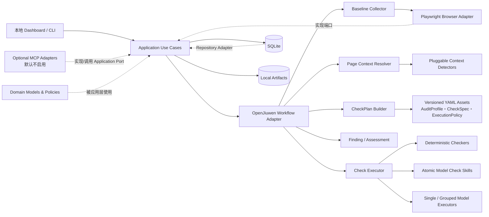

# 页面体验检查平台：本地 MVP 详细设计与任务拆解

> 状态：可执行设计稿  
> 日期：2026-08-24  
> 范围：本地 Dashboard、单页面检查、Token Plan 正常旅程、离线批量与人工标注  
> 目标工程：`/Users/vivian/Documents/Workspace/MetaPQP`  
> 上位架构：`docs/0817/page-driven-audit-architecture.md`

## 1. 目标与成功标准

本 MVP 的目标不是一次建成生产平台，而是验证一条可持续演进的纵向闭环：输入页面或旅程任务，系统自主采集证据、解析页面上下文、编译确定性的检查计划、执行原子检查能力，并生成页面维度的结果。

MVP 完成时必须满足：

1. 输入一个 URL 后，不依赖 Codex handoff 即可完成检查。
2. 相同输入、配置和资产版本生成相同的 `CheckPlan`。
3. Dashboard 默认按页面展示 Findings、截图和证据，而不是只按检查项展示。
4. 审核员可以对每个 Finding 单独标注。
5. Token Plan 正常旅程能够到达支付页，但系统不实现也不尝试支付。
6. CSV/JSON 批量任务能够输出页面级结果和批次摘要。

## 2. MVP 范围

### 2.1 本期实现

- 本地表单式 Dashboard 和 CLI；
- 手工录入 URL，以及 CSV/JSON Page Registry 导入；
- Desktop Web 与 Mobile Web 单页面检查；Mobile 使用 390×844 CSS px、3x DPR、Touch 与 iPhone User-Agent 的独立设备模拟；
- Baseline Collector、Page Context Resolver、CheckPlan Builder、Check Executor、Finding Processor 和 Assessment Builder；
- OpenJiuwen Python SDK 的确定性 Workflow Adapter；
- SQLite 元数据与本地 Artifact 文件；
- Token Plan 正常旅程：感知到下单并进入支付页；
- 三类跨页面一致性检查；
- 离线批量执行与逐 Finding 人工标注。

### 2.2 本期不实现

- JiuwenSwarm、Agent Runtime 和 MCP 的实际服务对接；MVP 只保留可选 MCP Port/Adapter；
- 官网运营管理台、发布审批和自动修改集成；
- 定时调度、页面变更事件和 CI/CD；
- 多用户权限、微服务、消息队列和 Kubernetes；
- 在线自修改 Skill；
- 正式 Golden Set 和完整业务指标平台。

## 3. 总体架构



关键边界：

- OpenJiuwen 负责连接步骤、传递状态和运行工作流，不承载业务规则。
- Domain 与 Application 中不得导入 OpenJiuwen、Playwright、Dashboard 或 SQLite 的具体类型。
- `CheckPlan` 由版本化配置和确定性逻辑编译，不由自由 Agent 临场决定。
- `CheckPlan.execution_batches` 固化本次 `local`、`model_single`、`model_batch` 调用拓扑；请求级 `single|grouped` 只决定如何生成这些批次。批调用只优化调度，不合并 CheckSpec、CheckRun 或 Finding 身份。
- 浏览器动作必须先经过 Action Guard；旅程执行也不能绕过它。
- MCP 只能通过稳定 Port 提供或获取能力，不能绕过应用层直接操作领域对象、浏览器或数据库。

## 4. OpenJiuwen 的使用方式

第一阶段只使用 `openjiuwen` Python 包，建立 `OpenJiuwenWorkflowRunner`。它把以下应用步骤注册为明确节点：

```text
load_request
  → collect_baseline
  → resolve_context
  → build_check_plan
  → acquire_missing_evidence
  → execute_checks
  → process_findings
  → build_assessment
  → persist_result
```

旅程任务在页面闭环外增加 `resolve_next_step`、`execute_guarded_action` 和 `aggregate_journey`。每个节点的输入输出使用平台自有 DTO；OpenJiuwen 状态对象只存在于 Adapter 内部。

不使用顶层 ReAct Agent 自主规划检查流程。模型只在指定的 Model Check Skill 中执行受约束的结构化判断。

### 4.1 模型接入

MVP 通过 OpenRouter 的 OpenAI-compatible Chat Completions 接口调用指定模型。具体 URL、API Key 和模型名只通过环境变量注入：

```text
OPENROUTER_BASE_URL
OPENROUTER_API_KEY
OPENROUTER_MODEL
```

仓库只提交 `.env.example` 的空占位符，不提交真实凭据。`OpenRouterModelAdapter` 实现应用层 `ModelPort`，Model Check Skill 和 Context Skill 不直接读取环境变量或调用 HTTP。

`ModelPort.complete_json` 返回结构化内容以及 Provider 实际返回的模型名、request ID、Prompt/Completion/Total Token、客户端观测时延和其他 usage 字段。`OpenRouterModelAdapter` 不估算或硬编码费用；Provider 返回的 `usage.cost` 等字段原样进入 `usage_details`。应用层将每次成功调用保存为 `ModelCallRecord`，并在 `audit.json -> run.model_execution` 聚合调用次数、Token、时延和费用。

模型 Prompt 不直接序列化完整 `PageSnapshot`。`ModelEvidenceCompactor` 仅发送可见正文和按页面顺序排列的语义元素，保留 tag、role、text、href、Alt 状态、enabled、interactive 与稳定 `element_ref`；selector 和 bounds 留在本地。模型结果只能引用已提供的 `element_ref`，执行器再从 Snapshot 恢复浏览器定位信息。当前适配器不把截图作为多模态输入，视觉像素判断不属于已实现的模型能力。

### 4.2 MCP 预留边界

MVP 不启动 MCP 服务，但预留两个可选适配方向：

```text
外部 MCP Server
  → MCP Client Adapter
  → Evidence/Capability Port
  → Audit Application

外部 Agent / 平台
  → MCP Server Adapter
  → submit/status/cancel/result Application Port
```

MCP Adapter 必须支持未配置时关闭、连接超时、能力白名单、输入输出 Schema 校验和错误隔离。外部 MCP Tool 只能作为证据或受控能力来源，不能自行修改 CheckPlan、Finding 或浏览器安全策略。

## 5. 核心模型

### 5.1 页面检查

| 模型 | 最小职责 |
|---|---|
| `PageAuditRequest` | URL、设备、语言、可选页面/旅程上下文、配置版本 |
| `PageTarget` | 本次运行的确定事实与约束 |
| `PageSnapshot` | DOM、截图、交互元素、导航、Console、Network 和轨迹引用 |
| `PageContext` | 旅程阶段、页面原型、关键业务特征和带证据的置信度 |
| `CheckSpec` | 规则身份、适用条件、证据要求、执行器和判定标准 |
| `CheckPlan` | 本次执行、跳过、补采的规则、原因、模型执行模式与显式执行批次 |
| `ExecutionBatch` | 一次 local、model_single 或 model_batch 调度单元及其有序 CheckSpec IDs |
| `CheckRun` | 单条 CheckSpec 的本次执行事实 |
| `ModelCallRecord` | 一次真实模型调用的批次、规则、Provider ID、模型、Token、时延和 usage |
| `Finding` | 面向业务的问题，含证据、严重度、置信度和页面位置 |
| `PageAssessment` | 页面维度的 Findings、覆盖状态和运行摘要 |

### 5.2 旅程检查

| 模型 | 最小职责 |
|---|---|
| `JourneyTemplate` | 通用阶段、阶段目标和允许的结构，不绑定具体产品 URL |
| `ProductJourneyBinding` | 将产品页面、入口、动作和到达标志绑定到模板阶段 |
| `Scenario` | Persona、前置条件、正常/异常状态、必需检查标签和少量强制规则 |
| `JourneyRun` | 一次旅程执行的步骤、页面结果、动作和覆盖状态 |
| `JourneyAssessment` | 多页面聚合与跨页面 Findings |

`Scenario` 不复制完整规则列表。原子 CheckSpec 通过标签和 `applies_when` 被动态选择；只有不可省略的关键规则才在 Scenario 中显式指定 ID。

七阶段的唯一配置事实位于 `config/journey_templates/cloud-product-lifecycle.yaml`，顺序为 `awareness`（感知）、`purchase`（购买）、`order`（下单）、`payment`（支付）、`usage`（使用）、`renewal`（续费）、`unsubscribe`（退订）。产品 URL 与稳定 `page_id` 由 `config/product_journey_bindings/*.yaml` 绑定到阶段。

Scenario 声明业务路径、Persona、认证要求和执行矩阵。默认矩阵为 `devices: [desktop, mobile]` 与 `locales: [zh-CN, en-US]`；Runner 必须把笛卡尔积展开为四个彼此独立的 PageTarget/Snapshot，不能跨设备或跨语言复用证据。请求显式参数作为矩阵过滤条件，并优先于 Scenario；Scenario 优先于 Product Binding 默认值。当前单页 CLI 已实现同样的矩阵展开；Journey Runner 消费 Scenario 并展开矩阵仍属于后续实现。

## 6. CheckPlan 如何动态拼装

“动态拼装”本质上是规则编译，不是 Agent 自由挑选：

```text
候选规则 = AuditProfile 声明的 CheckSpec 集合
        ∩ 当前渠道/设备支持的规则
        ∩ PageContext 标签满足 applies_when 的规则
        ∩ Scenario required_check_tags 命中的规则
        ∪ Scenario mandatory_check_ids

对每条候选规则：
  1. 校验规则、执行器和版本是否可用；
  2. 计算所需 Evidence；
  3. 已有证据足够 → planned；
  4. 缺证据且动作被策略允许 → needs_acquisition；
  5. 缺证据且动作不允许 → skipped/needs_verification；
  6. 保存选择、跳过和补采原因。
```

示例：

```text
输入：Token Plan 感知页 + Desktop Web + normal-to-payment
Context：stage=awareness, archetype=product_landing,
         features=[pricing, purchase_entry]

结果：
  page-load                 planned（所有 Web 页面）
  product-value-clarity     planned（product_landing）
  pricing-transparency      planned（pricing）
  cta-clarity               planned（purchase_entry）
  form-error-message        skipped（页面无 form）
  payment-risk-disclosure   skipped（尚未进入 payment）
```

目标 CheckPlan 契约必须逐步覆盖请求摘要、Snapshot ID、Context 版本、AuditProfile 版本、Scenario 版本和 CheckSpec 版本集合。当前 MVP 已物化的字段是 `plan_id`、Builder 版本、Profile ID、每条规则的选择/跳过原因、执行器引用、`model_execution_mode` 和 `execution_batches`；它们完整写入运行目录的 `checkplan.json`，同时在 `audit.json.check_plan` 保留同源投影。Snapshot、Context 和各 CheckSpec 的版本目前分别由 `audit.json.pages`、`asset_versions` 与 `check_runs` 关联，冻结 Snapshot 回放实现后再收敛为自包含的回放契约。

### 6.1 模型执行批次

模型调用模式由 `PageAuditRequest.model_execution_mode` 控制，CLI 参数为 `--model-execution single|grouped`，默认 `grouped`：

- `single`：每条模型 CheckSpec 形成一个 `model_single` 批次并单独调用，用作回归基线和故障定位；
- `grouped`：读取 `config/execution_policies/{audit_profile}.yaml`，把适用的模型 CheckSpec 编译为语义批次；
- 确定性 CheckSpec 始终进入 `local` 批次，并由本地 Checker 逐条执行。

当前 MVP 策略为：

```yaml
model_batches:
  - id: content-understanding
    check_specs:
      - copy-quality
      - terminology-clarity
      - content-internal-consistency
      - product-value-clarity
  - id: transaction-decision
    check_specs:
      - cta-clarity
      - pricing-transparency
      - commitment-risk-timing
```

Builder 在 grouped 模式下必须保证所有已选模型 CheckSpec 恰好属于一个配置批次；重复或遗漏属于配置错误并在执行前失败。Check Executor 按 `execution_batches` 顺序调用能力，最终再按 `CheckPlan.selected` 的原始顺序排列 CheckRun，避免批次改变报告顺序。

模型批次使用严格结构化输出，要求每个 CheckSpec 恰好返回一个结果。Provider 响应已经成功解析为结果集合后，某个 ID 缺失或重复时，仅为该 CheckSpec 生成 `needs_verification`；不会把其他有效结果丢弃，也不会自动追加 single 调用。模型未配置时，模型规则同样产生 `needs_verification`，确定性规则继续执行。HTTP/超时、JSON 无法解析或整体 Schema 校验失败属于批次级异常，当前不走上述单项隔离路径。

当前限制：模型 Adapter 的 HTTP 异常、超时或无法解析响应仍会向上抛出并可能终止本次 Workflow；系统尚未为“完全没有 Provider 响应”的调用创建失败型 `ModelCallRecord`。后续故障加固应在不产生隐藏额外调用的前提下，将失败批次转换为逐规则 `needs_verification`，并允许其他批次和报告继续完成。

### 6.2 批次执行不改变原子能力契约

每个模型 CheckSpec 仍通过自身 `skills/*/SKILL.md` 提供独立指令、版本和审核边界。`BatchModelSkillExecutor` 只是把同一语义批次的 Skill 指令与 CheckSpec 放入一个受约束调用，并将响应拆回逐规则 CheckRun。批次不是组合 Skill，不拥有新的业务规则，也不能跨规则合并 Finding。

当前语义证据压缩对两个模型批次都提供完整的紧凑证据，避免在没有 Golden Set 时因关键词过滤损失召回。后续如要按批次裁剪证据，必须使用冻结 Snapshot 和人工标注集证明不会降低关键问题召回。

### 6.3 规范来源与 CheckSpec 多对多映射

`StandardSource` 管理规范集合，`StandardCriterion` 管理条款，CheckSpec 通过 `standard_refs[]` 引用零到多个条款。每个引用显式声明 `implements`、`partial_coverage`、`supports` 或 `inspired_by`。反向看，一个条款也允许由多个 CheckSpec 共同覆盖。

当前启用 WCAG 2.2、Nielsen 10 Usability Heuristics 和 MetaPQP 内部检查建议；华为云设计规范只保留 `reserved` 来源，正式条款进入目录前不能被 CheckSpec 引用。详细的新增规则决策与报告措辞见 [规范来源与 CheckSpec 映射](../standards-governance.md)。

## 7. MVP 检查能力目录

### 7.1 确定性 Checkers

当前 `mvp` AuditProfile 启用五条通用本地规则：

1. `page-load`：页面可正常加载且主体内容有效；
2. `broken-links`：有限数量的页面可见 HTTP 链接是否失效；
3. `runtime-errors`：Console 与关键 Network 是否存在运行错误；
4. `document-structure`：Title、H1 和标题结构是否满足规则；
5. `image-alt`：可见图片是否声明 Alt 属性。

Mobile 请求额外启用两条设备限定的本地规则：

6. `mobile-horizontal-overflow`：排除轮播与显式横向滚动祖先后，定位超出 390 CSS px 视口超过 1 CSS px 的响应式布局元素；
7. `mobile-tap-target-size`：按钮、表单控件和按钮角色任一边低于 24 CSS px 时失败；明显图标链接仅在宽高均低于 24 CSS px 时失败，普通行内文本链接不判定；CheckRun 另统计低于 44×44 CSS px 推荐目标的候选控件。

24px 是当前失败阈值，44px 只作为优化参考，避免把普通行内文本链接批量误报。阈值和例外属于版本化 Checker v1.0.0 的判定实现，CheckSpec 保存规则语义与执行器版本。两条规则只在 `devices: [mobile]` 时进入 CheckPlan，Desktop 仍执行原有五条本地规则。

### 7.2 Model Check Skills

当前 `mvp` AuditProfile 启用七条独立模型规则：

1. `copy-quality`：明确错别字、重复词、缺字、语病和错误标点；
2. `terminology-clarity`：专业术语、状态名和计费名词是否容易理解；
3. `content-internal-consistency`：页面内部产品规则和承诺是否一致；
4. `product-value-clarity`：目标用户、问题和核心收益是否清晰；
5. `cta-clarity`：CTA 是否明确表达动作和结果；
6. `pricing-transparency`：价格、币种、周期、资源量和范围能否独立核对；
7. `commitment-risk-timing`：订阅、续期、退款和退订风险是否在决策前披露。

### 7.3 跨页面 Checkers / Skills

1. 产品身份与名称一致性；
2. 套餐、价格与计费口径一致性；
3. CTA 承诺与目标页面实际内容一致性。

当前 Profile 共包含 14 条 CheckSpec：Desktop 选择原有 12 条，Mobile 额外选择两条设备规则。原有 12 条仅在 TokenPlan 页面完成过 single 与 grouped 的同页回归；Mobile 规则还需要多页面人工复核，不能据单页结果宣称稳定召回。

## 8. Baseline 与上下文识别

Baseline 对所有页面执行相同的基础动作：导航和重定向记录、DOM、Viewport/全页截图、可访问性语义、可见内容投影、交互元素清单、链接目标、Console/Network 摘要，以及 Tab、Accordion、可逆 Modal 等低风险页面内状态。

Mobile Baseline 额外启用 `iphone-web-v1` 设备模拟，并生成逻辑证据 `mobile_layout`，落盘文件为 `artifacts/mobile-layout.json`：记录视口宽度、文档滚动宽度和可定位的意外横向溢出元素。溢出扫描排除 Carousel、Swiper、Slider 和拥有显式横向滚动行为的祖先容器。触控尺寸直接复用带 bounds 的交互元素清单；`mobile_layout` 同时证明本次 Snapshot 使用了 Mobile/Touch 上下文。

参考 Mobile Skill 中的菜单开关回放、低风险 CTA 点击反馈、固定底栏安全区、字号和首屏视觉层级暂未成为 CheckSpec：前两者需要 Targeted Evidence 与动作安全策略，固定栏和字号需要更多例外样本，首屏层级需要把截图纳入多模态模型证据。它们应在 Golden Set 和状态探索契约就绪后再逐项引入。

Page Context Resolver 对外只返回一个 `PageContext`，内部由可插拔 Detector 组合：

- `JourneyStageDetector`：感知、购买、下单、支付等主阶段和关联阶段；
- `PageArchetypeDetector`：产品落地页、列表页、配置页、订单页、支付页等；
- `CommerceFeatureDetector`：价格、套餐、购买入口、订单摘要、支付入口；
- 后续按需要增加 Form、Account Operation 或 Mobile 特征 Detector。

解析优先级为：请求显式值 > Page Registry / Product Binding > Detector observation > 默认值。冲突合并和置信度计算属于 Resolver，不散落在 Detector 中。

## 9. Token Plan 正常旅程与支付安全

### 9.1 覆盖目标

```text
感知页 → 购买/套餐页 → 配置或确认 → 提交一个订单 → 到达支付页 → 只读采证 → 结束
```

首期只要求覆盖“正常走到支付之前/支付页”，支付本身标记为 `partially_verified`，不能描述为已完成交易验证。

### 9.2 强制策略

- 仅允许 Token Plan、一个指定测试账号和配置中声明的入口；
- 运行前查询是否已有待支付订单；
- 每次运行最多创建一个订单，账号最多保留一个待支付订单；
- 超过限制时在提交前停止；
- 无法排除零元自动开通、自动扣费、后付费或优惠券自动激活时，提交前失败关闭；
- 到达支付页后立即切换为只读，只允许截图、DOM/金额读取和滚动；
- 支付页禁止点击、输入、勾选和提交；
- 代码中不实现任何支付工具或支付分支；
- 首期由人工取消订单，并在 Dashboard 明示待取消状态。

每次运行至少记录：

```text
order_created
payment_entry_reached
payment_page_observed
payment_action_attempted = false
transaction_verified = false
coverage = partially_verified
```

## 10. Dashboard

第一阶段建议使用 FastAPI + Jinja/HTMX 构建轻量本地界面，避免前后端工程过重；它只是接口适配器，可替换而不影响应用层。

最小页面：

1. 新建任务：单页面、Token Plan 旅程或批量导入；
2. 任务列表：状态、进度、耗时、失败原因；
3. 页面详情：页面截图、Findings、证据、覆盖状态和 CheckPlan 解释；
4. 旅程详情：阶段、页面、动作轨迹、跨页面问题和支付安全状态；
5. Finding 审核：接受、误报、需补证据、暂不处理、备注；
6. 批次摘要：完成率、页面数、Finding 数和失败任务。

### 10.1 最终输出件基线

MVP 每次成功完成的运行输出三个标准文件。模型批次异常若在持久化前终止 Workflow，当前不保证失败运行仍能生成这些文件。

每次单页面或旅程运行的标准输出目录为：

```text
output/{source}/{product}/{page_id}/{device}/{locale}/{run_id}/
├── audit.json
├── checkplan.json
├── report.html
├── screenshots/
└── artifacts/
```

其中 `page_id` 必须是产品内稳定、可读的语义名称，例如 `awareness`、`purchase`、`order-confirmation`，不能使用 URL Hash 或运行时间代替。目录层级同时保留设备与语言，从而使同一逻辑页面的 Desktop/Mobile、中文/英文结果可以直接辨识和比较。

其中：

- `audit.json` 是机器可读的权威输出，可供 Dashboard、批量汇总和后续平台集成读取；
- `checkplan.json` 是本次已物化计划的独立副本，完整保存当前 CheckPlan Schema 中的规则选择、跳过原因、Builder 版本、模型执行模式和批次，供比较与调试；它尚不是包含 Snapshot 与全部资产版本的自包含回放包；
- `report.html` 是可独立打开和分享的静态报告，由 `audit.json` 和 Artifact 渲染生成；
- `screenshots/` 保存报告直接使用的页面截图和问题标注图；
- `artifacts/` 保存 DOM、Accessibility、Console、Network 和轨迹等详细证据。

HTML 不成为第二套业务事实。报告中的数量、严重度、覆盖状态、问题说明和证据引用都必须来自同一份 `audit.json`。`checkplan.json` 与 `audit.json.check_plan` 必须由同一个内存 `CheckPlan` 序列化，不能各自重新计算。

### 10.2 report.html 的信息结构

保留现有报告已经验证有效的视觉和信息结构：侧边导航、总览指标、旅程阶段卡片、优先处理清单、截图、覆盖状态、详细检查折叠区、跨页面一致性表和完整问题清单。

新版将默认主视角从“检查项/阶段”调整为“页面”，建议顺序为：

```text
报告标题与运行信息
  → 问题汇总
  → 页面总览
  → 旅程总览（仅 Journey Run）
  → 优先处理清单
  → 页面详细报告
      ├── 页面截图与问题标注
      ├── 页面覆盖状态
      ├── 页面 Findings
      └── 详细检查结果（折叠）
  → 跨页面一致性（仅 Journey Run）
  → 完整问题清单
  → 运行与版本信息
```

一个旅程阶段可以包含多个页面，一个页面也可以关联多个阶段。因此报告中的“阶段详细报告”改为“页面详细报告”，阶段卡片点击后筛选或定位到该阶段关联的页面，而不是把 Stage 当作唯一结果容器。

问题卡片继续保留现有报告中的核心内容，并补充审核与溯源字段：

```text
问题 ID、标题、P0/P1/P2、页面、关联阶段、页面位置、元素定位
问题证据、违反的 CheckSpec/Standard、修改前、修改建议、截图标注
置信度、覆盖状态、CheckRun 引用、审核状态和审核备注
```

### 10.3 audit.json 的兼容与演进

`audit.json` 从 `schema_version: 2.2` 开始采用紧凑引用结构；`2.3` 增加结构化 `standard_refs[]` 和顶层去重后的 `standards` 目录。所有业务事实只保留一份，聚合对象通过 ID 引用，避免 Page、Section 和 Assessment 重复序列化同一批问题与检查结果。

单页面任务保留以下顶层字段：

```text
schema_version
source
input_url
generated_at
summary
sections
issues
standards
model
run
asset_versions
pages
page_assessments
check_plan
check_runs
reviews
```

其中 `summary` 继续保留 `score`、`issue_count`、`p0`、`p1`、`p2`；`issues` 是 Finding 的唯一完整序列化位置；`check_runs` 是检查执行事实的唯一完整序列化位置。`sections[].issue_refs`、`sections[].check_run_refs`、`page_assessments[].finding_refs` 和 `page_assessments[].check_run_refs` 只保存 ID。

`score` 在评分公式经过标注数据验证前允许为 `null` 或标记为 `experimental`，不能仅根据问题数量临时计算一个看似精确的分数。P0/P1/P2 数量和覆盖状态仍应正常输出。

字段职责为：

```text
run                  # 任务类型、状态以及 model_execution 调用明细与聚合用量
asset_versions       # Profile、CheckSpec、Skill、JourneySpec 和 Builder 版本
pages                # PageTarget、精简 Snapshot、唯一 PageContext
page_assessments     # 页面结果身份、覆盖状态以及 Finding/CheckRun 引用
check_runs           # 每条 CheckSpec 的执行事实
journey              # Journey Run 才存在，保存阶段、步骤和安全状态
reviews              # 可选的逐 Finding 审核投影
```

`run.model_execution` 的最小结构为：

```text
call_count
prompt_tokens
completion_tokens
total_tokens
latency_ms
cost
calls[]
  ├── call_id
  ├── batch_id
  ├── check_spec_ids[]
  ├── provider / model / provider_request_id
  ├── prompt_tokens / completion_tokens / total_tokens
  ├── latency_ms
  └── usage_details
```

聚合值仅汇总实际存在的 Provider 返回值：若部分调用有值、部分调用为 `null`，总计是已知值之和；若所有调用都没有该字段，聚合结果为 `null`。不能以零冒充 Provider 未返回的 Token 或费用。批次级调用记录与逐规则 CheckRun 分开保存，因为一次 `model_batch` 调用可以对应多条 CheckSpec。

大体积采集证据保存在 Artifact：

```text
artifacts/body.txt
artifacts/page.html
artifacts/interactions.json
artifacts/evidence-elements.json
artifacts/console.json
artifacts/network.json
```

Snapshot 在 `audit.json` 中只保留 Artifact 引用和 `evidence_summary` 计数，不重复内嵌正文、DOM 元素、交互元素、Console 和 Network 数组。`sections` 是供现有报告使用的轻量页面投影，不再内嵌完整 `issues` 或 `inspection_checks`。

`stage_analysis`、`stages_analyzed`、`stages_missing` 和 `cross_stage_checks` 仅由 Journey Run 生成；单页面任务不输出这些空字段。历史消费者如需旧的全量兼容结构，应按 `schema_version` 使用迁移适配器，而不是让主合同长期保存重复副本。

现有问题字段继续兼容，同时建议补充：

```text
page_id
snapshot_id
check_spec_id
check_spec_version
check_run_id
confidence
coverage_status
evidence_refs
journey_stage_refs
review_status
standard_refs
```

截图和 Artifact 应使用相对于运行目录的路径，例如 `screenshots/awareness.png`，避免生成包含重复 `output/...` 的脆弱相对路径。

## 11. 本地持久化

SQLite 最小表：

```text
audit_jobs
page_targets
page_snapshots
page_contexts
check_plans
check_runs
findings
page_assessments
finding_reviews
journey_runs
journey_steps
batch_runs
asset_versions
```

Artifact 文件布局：

```text
data/artifacts/{job_id}/{page_snapshot_id}/
├── page.html
├── dom.json
├── accessibility.json
├── screenshot-viewport.png
├── screenshot-full.png
├── interactions.json
├── console.json
├── network.json
└── trace.json
```

SQLite 只保存可查询元数据和 Artifact 引用，不把大体积 DOM、截图或完整 Network 内容写入数据库。敏感 Header、Cookie、Token 和表单值必须在落盘前脱敏。

## 12. Python 项目目录

```text
MetaPQP/
├── pyproject.toml
├── README.md
├── src/
│   └── portal_audit/
│       ├── __init__.py
│       ├── domain/
│       │   ├── page/
│       │   │   └── models.py
│       │   ├── context/
│       │   │   ├── models.py
│       │   │   ├── taxonomy.py
│       │   │   └── policies.py
│       │   ├── checks/
│       │   │   ├── models.py
│       │   │   ├── check_spec.py
│       │   │   └── applicability.py
│       │   ├── journey/
│       │   │   └── models.py
│       │   └── findings/
│       │       ├── models.py
│       │       └── policies.py
│       ├── application/
│       │   ├── ports/
│       │   │   ├── browser.py
│       │   │   ├── model.py
│       │   │   ├── repositories.py
│       │   │   ├── artifact_store.py
│       │   │   ├── workflow.py
│       │   │   └── mcp.py
│       │   ├── use_cases/
│       │   │   ├── run_page_audit.py
│       │   │   ├── run_journey_audit.py
│       │   │   ├── run_batch_audit.py
│       │   │   └── review_finding.py
│       │   └── services/
│       │       ├── baseline_collector.py
│       │       ├── page_context_resolver.py
│       │       ├── check_plan_builder.py
│       │       ├── targeted_evidence.py
│       │       ├── check_executor.py
│       │       ├── finding_processor.py
│       │       ├── assessment_builder.py
│       │       └── journey_executor.py
│       ├── capabilities/
│       │   ├── context_detectors/
│       │   │   ├── journey_stage.py
│       │   │   ├── page_archetype.py
│       │   │   └── commerce_features.py
│       │   ├── checkers/
│       │   │   └── page.py              # 当前聚合通用与 Mobile 确定性 Checkers
│       │   └── cross_page/
│       │       ├── product_identity.py
│       │       ├── price_consistency.py
│       │       └── cta_destination.py
│       ├── skill_runtime/
│       │   ├── registry.py
│       │   ├── loader.py
│       │   ├── executor.py
│       │   ├── batch_executor.py
│       │   ├── evidence_compactor.py
│       │   └── output_validator.py
│       ├── adapters/
│       │   ├── openjiuwen/
│       │   │   ├── workflow_runner.py
│       │   │   ├── components.py
│       │   │   └── model_client.py
│       │   ├── browser/
│       │   │   ├── playwright_browser.py
│       │   │   ├── action_guard.py
│       │   │   └── payment_guard.py
│       │   ├── persistence/
│       │   │   ├── sqlite.py
│       │   │   └── repositories.py
│       │   ├── artifacts/
│       │   │   └── local_store.py
│       │   ├── imports/
│       │   │   └── page_registry_file.py
│       │   └── mcp/
│       │       └── client.py
│       ├── interfaces/
│       │   ├── dashboard/
│       │   │   ├── app.py
│       │   │   ├── views.py
│       │   │   ├── templates/
│       │   │   └── static/
│       │   ├── mcp/
│       │   │   └── server.py
│       │   └── cli.py
│       └── bootstrap.py
├── skills/
│   ├── page-context/
│   │   ├── journey-stage-classifier/
│   │   │   └── SKILL.md
│   │   └── page-archetype-classifier/
│   │       └── SKILL.md
│   ├── product-value/
│   │   ├── SKILL.md
│   │   ├── references/
│   │   └── schemas/
│   ├── cta-clarity/
│   │   ├── SKILL.md
│   │   ├── references/
│   │   └── schemas/
│   ├── fee-transparency/
│   │   └── SKILL.md
│   └── risk-disclosure/
│       └── SKILL.md
├── config/
│   ├── audit_profiles/
│   │   └── mvp.yaml
│   ├── execution_policies/
│   │   └── mvp.yaml
│   ├── context_profiles/
│   │   └── default-web.yaml
│   ├── check_specs/
│   ├── journey_templates/
│   │   └── cloud-product-lifecycle.yaml
│   ├── product_journey_bindings/
│   │   └── token-plan.yaml
│   ├── scenarios/
│   │   ├── normal-to-payment.yaml
│   │   ├── unauthenticated.yaml
│   │   └── no-resource.yaml
│   └── policies/
│       ├── browser-safety.yaml
│       └── token-plan-order.yaml
├── data/
│   ├── imports/
│   │   └── pages.csv
│   ├── app.db
│   └── artifacts/
├── tests/
│   ├── unit/
│   ├── contract/
│   ├── integration/
│   └── fixtures/
├── scripts/
│   ├── import_pages.py
│   ├── run_page.py
│   ├── run_journey.py
│   └── run_batch.py
└── docs/
```

## 13. 开发任务拆解

### Epic A：工程骨架与契约

- 建立 `pyproject.toml`、`src` 布局、配置加载、日志和测试框架；
- 定义领域模型、枚举、版本字段和序列化契约；
- 定义 Browser、Model、Repository、ArtifactStore 和 Workflow Ports；
- 建立 SQLite migration 和本地 Artifact Store；
- 建立 OpenJiuwen Workflow Runner 的最小连通测试。

完成条件：一个空流程可以由 CLI 启动，写入任务状态并产生结构化结果。

### Epic B：单页面 Baseline

- 抽取 Playwright Browser Adapter；
- 实现 Action Guard、采集预算和脱敏；
- 采集 DOM、截图、可访问性、交互元素、链接、Console、Network 和轨迹；
- 组装不可变 PageSnapshot 并保存 Artifact。

完成条件：对代表性页面重复运行能够获得完整、可追溯、已脱敏的 Snapshot。

### Epic C：Context 与 CheckPlan

- 实现三个首批 Context Detectors；
- 实现显式配置优先的合并和置信度策略；
- 建立 YAML CheckSpec/AuditProfile/ContextProfile 加载与校验；
- 实现确定性 CheckPlan 编译和解释信息；
- 为相同输入的计划稳定性编写快照测试。

完成条件：感知页和购买页生成不同、可解释且可复现的 CheckPlan。

### Epic D：检查执行与页面结果

- 实现首批确定性 Checkers、模型结构化输出适配和 Model Check Skills；
- 实现版本化 ExecutionPolicy、single/grouped 执行、逐 CheckSpec 批响应校验和 ModelCallRecord 用量记录；
- 实现缺证据补采、CheckRun、Finding 归一化/去重和 Assessment Builder；
- 实现模型超时、失败和证据不足状态，不把失败误报为通过。

完成条件：单页面从 URL 到 PageAssessment 全程无需人工 handoff。

### Epic E：本地 Dashboard

- 新建任务、任务列表、页面详情、证据查看和 CheckPlan 解释；
- 实现逐 Finding 标注和备注；
- 保证页面报告以 Finding 为主，检查项只作为溯源信息。

完成条件：演示者只通过浏览器界面即可提交页面并完成结果审核。

### Epic F：Token Plan 旅程

- 配置 Journey Template、Product Binding 和 normal-to-payment Scenario；
- 实现 Journey Executor、阶段到达标志和跨页面聚合；
- 实现订单数量限制、Payment Guard、只读模式和安全状态字段；
- 实现三类跨页面一致性检查；
- 建立人工取消订单的运行后提示。

完成条件：指定账号最多生成一个待支付订单，到达支付页后无任何支付动作，并输出 JourneyAssessment。

### Epic G：批量与反馈数据

- 实现 CSV/JSON 导入校验、批次执行和失败隔离；
- 实现批次摘要和页面结果索引；
- 导出 Finding 与人工标注，为后续 Golden Set 建设提供原始数据。

完成条件：一批页面中单个失败不阻断其他页面，且每个 Finding 都可独立审核和导出。

### Epic H：验证与演示封板

- 单元测试：规则适用条件、合并策略、计划稳定性、安全策略；
- 契约测试：各 Adapter 对 Ports 的实现；
- 集成测试：单页面、Token Plan 旅程和批量任务；
- 故障测试：模型失败、浏览器超时、证据缺失、重复提交和支付页误操作；
- 回归测试：使用冻结的同一 Snapshot 比较 single/grouped 的逐规则状态、Finding 召回、定位完整性、Token、费用和时延；
- 固化 Demo 数据、运行说明和验收清单。

完成条件：第 1 节六项成功标准全部通过并留下可复核证据。

## 14. 推荐开发顺序

```text
A 工程骨架
  → B Baseline
  → C Context / CheckPlan
  → D PageAssessment
  → E Dashboard
  → F Token Plan Journey
  → G Batch / Review
  → H Verification
```

不要先把所有历史检查项迁移完再联调。每个阶段优先形成最小纵向闭环，再扩充 CheckSpec 和页面样本。

## 15. 后续演进边界

进入团队阶段时，新增 REST API、队列/Worker、PostgreSQL 和对象存储适配器；进入生产阶段时，再增加 CI/CD、页面变更事件、可观测性、Browser Worker Pool 和部署治理。只要 Ports 和领域契约保持稳定，本地 MVP 的核心模块无需重写。

MCP 只在需要向其他 Agent 或外部系统暴露工具时引入；JiuwenSwarm 只在确实需要多 Agent 协作时评估；Agent Runtime 只在团队决定采用其服务部署能力时接入。三者都不是当前 MVP 成功的必要条件。
