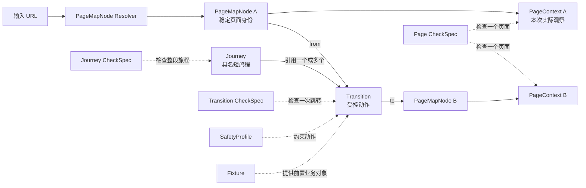

# Page Map Node 驱动的 Page / Transition / Journey 审计实施计划

> 状态：In Progress  
> 日期：2026-08-28  
> 范围：基于当前 MetaPQP 单页审计能力，增加触点地图、安全页面跳转和短旅程检查  
> 本文是分阶段实施计划；实际完成范围以“当前实现”说明为准。

> 当前实现：已完成 TokenPlan `tokenplan-awareness-purchase-preview` 有监督垂直切片，包括轻量 PageMapNode、白名单 Transition、生产只读 SafetyProfile、同一 Browser Context 的多步顺序执行能力、3 条 Transition CheckSpec、通用跨阶段 JourneyEvidence、9 条 Journey CheckSpec 及独立 Journey JSON/HTML 详细检查。Journey CheckPlan 已支持同一规则在任意相邻节点、锚点到各节点或全部节点集合上重复实例化；通用 Touchpoint、Fixture、可实际运行的多步产品 Journey 配置和 Evidence Collection 仍未实现。

## 1. 结论摘要

当前系统已经形成稳定的单页审计闭环：输入 URL 后采集一个 `PageSnapshot`，解析 `PageContext`，构建 `CheckPlan`，执行 Python Checker、文本模型 Skill 和视觉模型 Skill，最后生成 `PageAssessment`。

下一阶段不应重写该闭环，而应在它的外层增加一个以 Page Map Node 为入口的编排层。产品和业务表达中仍可称其为“审计触点”，代码和配置中统一使用 `PageMapNode`：

```text
URL
 ↓
PageMapNode Resolver
 ├─ Page Audit：复用现有单页流水线
 ├─ Transition Audit：执行一次受控动作并比较前后状态
 └─ Journey Audit：编排具名短旅程或聚合多个直接入口的证据
```

核心决策如下：

1. `page`、`transition`、`journey` 是三种 CheckSpec 检查范围，不是三个业务阶段。
2. URL 先解析为轻量 `PageMapNode`，只确定稳定页面身份、预期业务阶段、页面 Surface 和登录要求；Transition、Journey、Fixture 和 Safety 由各自配置独立管理。
3. 所有 CheckSpec 显式声明 `scope`；旧规则缺省迁移为 `page`，保持兼容。
4. Page CheckSpec 在页面快照完成时触发；Transition CheckSpec 只在真实执行一次允许动作并取得前后快照后触发；Journey CheckSpec 只在短旅程达到安全终点或证据集合完整后触发。
5. 用户只提供 URL 时，初版默认运行 `touchpoint` 模式：执行当前 Page 检查，并最多执行一步配置为自动运行的低风险 Transition；不自动运行全部 Journey。
6. Journey 必须是具名、版本化的短旅程。它可以是连续导航，也可以是多个直接入口的证据聚合，不能强制模拟完整交易生命周期。
7. 支付、充值提交、续费提交、变更提交、退订确认、资源删除等动作在生产拨测中永久禁止。

## 2. 当前系统基线

### 2.1 已经具备的能力

当前 `PageAuditPipeline` 的实际执行链路为：

```text
collect_baseline
  → resolve_context
  → build_plan
  → execute_checks
  → build_assessment
  → persist
```

已经具备：

- Portal / Console 页面识别和登录态复用；
- Desktop / Mobile、中文 / 英文运行矩阵；
- DOM、可见文本、交互元素、Network、Console 和截图证据；
- Python Checker、文本模型批次和视觉模型批次；
- CheckSpec Registry、AuditProfile、ExecutionPolicy 和 Standards 映射；
- OpenJiuwen 单页工作流；
- 单页结果落盘和 SQLite 任务状态。

### 2.2 当前边界

当前所有核心合同都是单页边界：

- `PageAuditRequest` 只描述一个 URL；
- `BrowserPort.capture()` 只返回一个 `PageSnapshot`；
- `CheckPlanBuilder` 只根据一个 `PageContext` 选择规则；
- `CheckExecutor.execute()` 只接收一个 `PageSnapshot`；
- `PageAssessment` 和 `Finding` 绑定一个页面和一个快照；
- OpenJiuwen 工作流是固定的单页顺序图；
- 当前没有 Transition Trace、Journey Run、跨页面事实或 Journey Assessment。

现有 `applies_when.stages` 只表示规则是否适用于当前页面阶段。例如 `[order, payment]` 表示分别在订单页和支付页运行，并不表示比较两个页面。

### 2.3 配置上的不一致

当前 `cloud-product-lifecycle` 仍包含：

```text
awareness → purchase → order → payment → usage → renewal / unsubscribe
```

这与已确认的业务范围不一致：

- `usage` 应移除；
- `recharge` 和 `change` 缺失；
- “购买”和“下单”的边界重叠，建议将产品配置页归入 `order`，对外统一称“下单”；
- 现有 Journey 配置尚未进入运行时执行，只能视为待迁移资产。

### 2.4 当前 Journey 不是可执行点击流程

当前三类配置只表达了部分静态意图：

| 配置 | 当前实际表达 | 当前缺失 |
|---|---|---|
| `journey_templates/cloud-product-lifecycle.yaml` | 阶段列表和允许的阶段关系 | 页面、动作、终点断言和安全停止 |
| `product_journey_bindings/token-plan.yaml` | 感知页和购买页的部分 URL | 从哪个元素点击、订单与支付页面 |
| `scenarios/tokenplan-normal-to-payment.yaml` | 期望覆盖的阶段、运行矩阵和支付只读意图 | 可执行步骤、Transition 和运行时编排 |

当前代码仍只运行 `PageAuditPipeline`。现有 Journey YAML 没有驱动浏览器从一个页面点击到另一个页面，相关测试也主要验证配置结构。因此本计划中的 Transition Runner 和 Journey Orchestrator 是新增能力，不能把现有阶段配置当作已经实现的 Journey 执行器。

## 3. 目标与非目标

### 3.1 目标

- 保留“给一个 URL 即可检查”的简单入口；
- 将 URL 稳定解析为已知 PageMapNode，未命中时仍可继续单页审计；
- 区分并正确触发 Page、Transition 和 Journey CheckSpec；
- 优先支持可直接进入的费用中心和 Portal 页面；
- 支持从直接入口执行一步安全跳转；
- 支持以预置订单或资源为条件的具名短旅程；
- 支持通过订单号、交易号、资源 ID 等关联多个直接入口证据；
- 在报告中区分“通过、失败、待确认、执行错误、未覆盖、被安全策略阻止”。

### 3.2 非目标

初版不做：

- 自动探索并执行所有可点击控件；
- 从感知一直跑到退订的完整生命周期；
- 创建真实订单以准备支付测试；
- 真实支付、充值、续费、变更、退订或资源删除；
- 通用化所有产品控制台的升降配流程；
- 在缺少测试夹具时临时购买资源；
- 让大模型自主决定是否可以执行高风险动作。

## 4. 核心概念

### 4.1 审计触点与 PageMapNode

第一版将审计触点严格收敛为：

> Page Map 中一个可通过 URL 识别、具有稳定业务 ID 和预期业务阶段的页面入口。

代码和配置使用 `PageMapNode`，避免让“Touchpoint”承担过多运行时职责。V1 最小定义只有：

```yaml
id: fee-center-renewal-management
version: 1.0.0
url_patterns:
  - "account.huaweicloud.com/**#/userindex/renewalManagement"
expected_stage: renewal
expected_surface: console
auth_required: true
```

PageMapNode 第一版只回答：

1. 输入 URL 对应哪个稳定页面节点；
2. 该页面预期属于哪个交易阶段；
3. 它预期是 Portal 还是 Console；
4. 进入前是否需要登录。

PageMapNode 第一版不保存：

- 出边 Transition；
- Journey 引用；
- Fixture 要求；
- 页面级安全动作；
- Tab、弹窗和筛选状态；
- 实际 DOM、文本、Feature 或页面原型。

这些信息分别由 Transition、Journey、Fixture、SafetyProfile 和运行时 PageContext 管理，避免一个节点配置同时承担所有职责。

### 4.2 PageMapNode 与 PageContext

两者存在少量字段重叠，但语义不同：

| 对象 | 性质 | 回答的问题 |
|---|---|---|
| `PageMapNode` | 版本化静态配置 | 这个 URL 按设计应该是什么页面 |
| `PageContext` | 每次采集后的运行时事实 | 浏览器这次实际到了哪里、页面包含什么 |
| `PageSnapshot` | 本次运行的原始证据 | 上述判断由哪些 DOM、文本、截图和网络事实支持 |

例如，续费管理 URL 可以匹配 `fee-center-renewal-management`，但实际页面可能因为登录失效显示登录页。此时 PageMapNode 仍表示“预期续费管理”，PageContext 则表示“实际登录页”。系统必须停止续费 Transition，不能仅凭 URL 认为页面到达成功。

第一版关系为：

```text
URL
 ↓
PageMapNode Resolver ──→ 预期页面身份
 ↓
PageTarget
 ↓
浏览器采集 PageSnapshot
 ↓
PageContext Resolver ──→ 实际页面分类与特征
 ↓
预期与实际核对
 ↓
Page CheckPlan
```

未命中 PageMapNode 时，PageContext 和 Page 审计仍然照常执行，只是不自动关联 Transition 或 Journey。

### 4.3 Node、Transition、Journey 与 CheckSpec 的关系



职责可以简化为：

| 对象 | 只回答什么 |
|---|---|
| PageMapNode | 这是什么页面入口 |
| PageContext | 本次实际看到了什么 |
| Transition | 从节点 A 如何安全到达节点 B |
| Journey | 哪些 Transition 构成一个短旅程 |
| SafetyProfile | 本次环境允许执行到哪里 |
| Fixture | 执行某次跳转需要什么已有业务对象 |
| CheckSpec | 对 Page、Transition 或 Journey 检查什么 |

PageMapNode 不内嵌这些关系。Transition 通过 `from` / `to` 引用节点；Journey 引用 Transition；Registry 可以反向查询“从当前节点可用的 Transition”和“包含当前节点的 Journey”。

### 4.4 CheckSpec Scope

| Scope | 输入证据 | 典型规则 |
|---|---|---|
| `page` | 一个 PageSnapshot 和 PageContext | 页面加载、术语、状态清晰度、退款说明 |
| `transition` | 起点快照、动作记录、终点快照 | 跳转正确性、对象连续性、金额连续性 |
| `journey` | 多个触点、多个 Transition 和关联事实 | 产品身份、商业条件、规格权益、术语和状态的跨阶段一致性 |

Journey CheckSpec 不绑定固定的 A→B 阶段。`comparison.mode` 定义 `adjacent`、`anchor_to_each` 或 `all_observed`，`JourneyCheckPlanBuilder` 再根据本次证据生成一个或多个 `CheckInvocation`。因此同一条商业条件规则可以分别产生 A-B、B-C 等 CheckRun，而不需要复制 CheckSpec。

### 4.5 Journey 执行方式

Journey 支持两种执行方式：

1. `sequential`：从一个直接入口出发，连续执行若干安全 Transition，到安全终点停止。
2. `evidence_collection`：分别直接进入多个页面，通过订单号、交易号或资源 ID 聚合证据，不要求连续点击。

后者适用于支付、退款、充值记录和账单对账。

Journey 应由具体审计需求驱动，而不是复制一条固定的完整交易生命周期。同一个直接入口可以关联多个具名 Journey，例如续费管理可以分别定义手动续费预览、自动续费预览、到期转按需预览和到期不续费预览；任务必须明确选择其中一个，系统不因 URL 命中而全部执行。

第一版遵循以下原则：

1. 一个 Journey 只解决一个明确业务目标；
2. 优先从可直接进入的 PageMapNode 开始；
3. 每一步必须引用已经登记和审核的 Transition；
4. “从哪里点击什么、预期到哪里”由 Transition 定义，不在 Journey 中重复；
5. Journey 必须声明夹具要求、完成条件和安全终点；
6. 缺少订单或资源夹具时返回 `not_covered`，不能临时创建资源；
7. 生产环境禁止执行最终提交动作；
8. 大部分 CheckSpec 仍由 Scope 和 `applies_when` 动态选择，Journey 只声明少量不可缺失的关键规则。

第一版允许用户选择预定义 Journey；后续可以支持按需求临时组合已登记 Transition，但不能让模型临时发明点击路径或绕过 SafetyProfile。

## 5. 对外触发契约

### 5.1 兼容现有命令

现有命令继续可用：

```text
meta-pqp page --url <URL>
```

它保持纯 Page 审计语义，不自动导航。

### 5.2 新增统一审计入口

建议新增：

```text
meta-pqp audit --url <URL> --scope page
meta-pqp audit --url <URL> --scope touchpoint
meta-pqp audit --url <URL> --scope transition --transition <ID>
meta-pqp audit --url <URL> --scope journey --journey <ID>
```

语义如下：

| 请求 Scope | 行为 |
|---|---|
| `page` | 只执行当前页面检查 |
| `touchpoint` | Page 检查 + 最多一步可自动执行的安全 Transition |
| `transition` | 执行指定 Transition，并检查起点、终点和跳转本身 |
| `journey` | 执行指定具名 Journey，到安全终点停止 |

不建议让 `journey` 根据一个 URL 自动选择并运行所有候选旅程。

这里的 `touchpoint` 只是对外请求模式名称，表示“以已映射页面为锚点，执行 Page 检查并评估一步安全跳转”；它不是第四种 CheckSpec Scope，也不代表 PageMapNode 本身保存 Transition 或 Journey 关系。

### 5.3 请求模型

建议引入统一请求，但保留 `PageAuditRequest` 作为内部单页合同：

```yaml
url: https://example.com/page
scope: touchpoint
transition_id: null
journey_id: null
audit_profile: mvp
auth_mode: required
safety_profile: production-readonly
fixture_bindings: {}
max_transition_depth: 1
```

请求校验规则：

- `transition` 必须指定 `transition_id`；
- `journey` 必须指定 `journey_id`；
- `touchpoint` 默认 `max_transition_depth=1`；
- 请求不能覆盖 SafetyProfile 中的禁止动作；
- Fixture 只引用账号或资源别名，不能在配置和报告中暴露凭据。

## 6. 目标架构

```text
AuditRequest
    ↓
PageMapNodeResolver
    └─ resolved node / unmapped
    ↓
AuditScopeRouter
    ├──────────────────────────────────────┐
    │                                      │
PageAuditPipeline                   JourneyOrchestrator
（保留现有闭环）                    ├─ FixtureResolver
    │                               ├─ GuardedBrowserSession
    │                               ├─ TransitionRunner
    │                               └─ PageAuditPipeline × N
    │                                      │
    └──────────── PageAssessment ──────────┤
                                           ↓
                               Transition / Journey Planner
                                           ↓
                               ScopedCheckExecutor
                                           ↓
                               JourneyAssessmentBuilder
                                           ↓
                                     Result Writer
```

设计原则：

- `PageAuditPipeline` 不负责点击和旅程循环；
- 浏览器会话生命周期由外层 Orchestrator 管理；
- OpenJiuwen 负责编排稳定的高层步骤，安全规则和浏览器动作仍由确定性代码控制；
- Journey 不直接拼接原始 DOM，优先消费页面评估、结构化交易事实和证据引用，避免状态膨胀。

## 7. 领域模型改造

### 7.1 CheckSpec

新增：

```python
class CheckScope(StrEnum):
    PAGE = "page"
    TRANSITION = "transition"
    JOURNEY = "journey"

class CheckSpec(BaseModel):
    scope: CheckScope = CheckScope.PAGE
```

兼容策略：旧 YAML 没有 `scope` 时默认为 `page`。迁移完成后，再考虑将其变成必填字段。

`applies_when` 按 Scope 扩展：

```yaml
# page
applies_when:
  stages: [renewal]
  page_surfaces: [console]

# transition
applies_when:
  transition_ids: [unpaid-order-to-payment-preview]
  from_stages: [payment]
  to_archetypes: [payment_confirmation]

# journey
applies_when:
  journey_ids: [order-payment-bill-trace]
  execution_modes: [evidence_collection]
```

Registry 必须校验 Scope 与适用条件、Required Evidence、Executor 能力是否匹配。

### 7.2 轻量 PageMapNode

V1 只新增两个轻量合同：

```python
class PageMapNode(BaseModel):
    id: str
    version: str
    url_patterns: list[str]
    expected_stage: str
    expected_surface: PageSurface
    auth_required: bool = False
    product: str | None = None

class PageMapNodeResolution(BaseModel):
    node_id: str | None
    node_version: str | None
    matched_pattern: str | None
    status: str  # matched / unmapped / ambiguous
```

配置示意：

```yaml
id: fee-center-renewal-management
version: 1.0.0
url_patterns:
  - "account.huaweicloud.com/**#/userindex/renewalManagement"
expected_stage: renewal
expected_surface: console
auth_required: true
```

`product` 仅用于产品专属页面，费用中心公共节点可以为空。现有 `PageTarget` 不被替换；它只增加可选 `page_map_node_id`，记录本次运行关联到哪个稳定节点。

V1 解析流程只做确定性 URL Pattern 匹配。动态 Query、Locale、Region、Agency 等参数在匹配前规范化或忽略，Hash Route 保留。页面采集后再用 PageContext 验证实际状态；URL 命中但实际为登录页、错误页时，不能视为节点成功到达。

### 7.3 独立关系合同

Transition、Journey、Fixture 和 SafetyProfile 独立定义，不嵌入 PageMapNode：

```yaml
# Transition
id: renewal-resource-to-preview
version: 1.0.0
from: fee-center-renewal-management
to: fee-center-renewal-preview

action:
  type: click
  target:
    role: button
    name: 续费
    within_fixture: renewable_subscription

end_condition:
  page_map_node: fee-center-renewal-preview

risk_level: confirmation_only
fixture_type: renewable_subscription
safe_stop: renewal_preview_loaded
```

```yaml
# Journey
id: manual-renewal-preview
version: 1.0.0
goal: 检查用户能否定位到期资源并理解续费价格和周期
execution_mode: sequential
start: fee-center-renewal-management
transitions:
  - renewal-resource-to-preview
fixture_requirements:
  - renewable_subscription
completion_condition:
  transition_completed: renewal-resource-to-preview
safe_stop:
  prohibit_next_action: submit_renewal
```

独立 Registry 负责校验引用和反向建立索引，不在多个配置中重复维护同一关系。

Transition 是“页面从哪里点到哪里”的唯一配置事实，至少定义：

- 起点 `from`；
- 终点 `to`；
- 确定性的 Action 和语义 Locator；
- 到达终点的断言；
- 所需 Fixture；
- 风险等级和安全停止位置。

Journey 只定义业务目标、起点、Transition 顺序、夹具集合、完成条件和安全终点，不复制按钮 Locator。

对于 Tab、展开区域或确认弹窗等同 URL 状态变化，V1 不需要创建复杂状态节点。Transition 可以让 `from` 和 `to` 引用同一个 PageMapNode，通过动作后的 `end_condition` 判断状态已经变化：

```yaml
id: renewal-open-confirmation-dialog
from: fee-center-renewal-management
to: fee-center-renewal-management
action:
  type: click
  target: {role: button, name: 续费}
end_condition:
  visible: {role: dialog, heading: 续费确认}
```

动作前后的 PageSnapshot 仍分别采集，Transition CheckSpec 可以比较对象、金额和界面状态。只有当同 URL 状态需要成为多个 Journey 的稳定独立起点时，才在 V2 将其提升为状态节点。

证据聚合型 Journey 不执行连续点击，而是分别直接进入多个节点采证：

```yaml
id: order-payment-bill-trace
version: 1.0.0
execution_mode: evidence_collection
touchpoints:
  - node: fee-center-orders
    collect: [order_id, order_amount, order_status]
  - node: fee-center-transactions
    collect: [transaction_id, order_id, paid_amount]
  - node: fee-center-bill-details
    collect: [order_id, billed_amount, billing_period]
correlation_keys: [order_id]
```

这种 Journey 适合订单、支付流水、退款和账单对账，不需要重新下单或支付。

### 7.4 未来扩展边界

V1 不提前创建空的复杂字段。后续以可选字段和 Schema Version 增量扩展：

| 版本方向 | 可能增加的能力 |
|---|---|
| V2 页面状态节点 | Tab、弹窗、页面签名、同 URL 状态区分 |
| V2 进入策略 | `direct_url`、`fixture_navigation`、`navigation_only` |
| V3 动态业务节点 | URL + 页面状态 + Fixture 联合解析 |
| V3 多产品覆盖 | Locale、Region、产品控制台差异和节点继承 |

未来字段示意：

```yaml
# 非 V1 实现范围
state_discriminator:
  tab: manual_renewal

expected_page:
  title_contains: 续费管理
  required_elements: [renewal_tabs]
```

这些扩展不改变 V1 的稳定节点 ID，也不要求重写已有 Journey 引用。

### 7.5 运行时证据模型

建议新增：

| 模型 | 用途 |
|---|---|
| `PageMapNodeResolution` | 记录 URL 匹配结果、配置版本和状态 |
| `ActionRecord` | 记录动作 ID、元素、开始时间、结果和安全判定 |
| `TransitionTrace` | 绑定起点、动作、终点和重定向链 |
| `TransitionEvidence` | 提供前后快照引用及结构化差异 |
| `TransactionFacts` | 产品、订单、资源、金额、周期、状态等规范化事实 |
| `TransitionAssessment` | Transition CheckRun 和 Finding |
| `JourneyRun` | 记录 Journey 当前步骤、终止原因和覆盖状态 |
| `JourneyAssessment` | Journey CheckRun、跨页面 Finding 和总体覆盖 |
| `AuditBundleResult` | 汇总 Page、Transition、Journey 三层结果 |

跨页面 Finding 不能继续强制绑定单一 `page_id` 和 `snapshot_id`。建议增加通用 `evidence_refs`，同时保留可选主页面用于报告定位。

### 7.6 状态与覆盖结果

除现有 CheckStatus 外，编排层需要明确：

- `completed`：到达预期安全终点；
- `partial`：只完成部分步骤；
- `not_covered`：缺少夹具或入口；
- `blocked_by_policy`：下一步被安全策略阻止；
- `entry_unavailable`：直接入口无法访问；
- `unexpected_state`：运行时 PageContext 与 PageMapNode 的预期身份不匹配。

“缺少可退订资源”不能报告成检查失败；它应是 `not_covered`。

## 8. 配置资产改造

建议目录：

```text
config/
├─ audit_profiles/
├─ check_specs/
├─ execution_policies/
├─ page_maps/
│  ├─ huaweicloud-fee-center.yaml
│  └─ products/
│     └─ token-plan.yaml
├─ transitions/
│  ├─ renewal-resource-to-preview.yaml
│  └─ unsubscribe-resource-to-refund-preview.yaml
├─ journey_templates/
│  ├─ manual-renewal-preview.yaml
│  ├─ unsubscribe-refund-preview.yaml
│  └─ order-payment-bill-trace.yaml
├─ safety_profiles/
│  └─ production-readonly.yaml
├─ fixture_profiles/
│  └─ README.yaml
└─ standards/
```

约束：

- Page Map 只保存轻量 PageMapNode，不保存边、CheckSpec、Fixture 或 Safety；
- Transition 通过 `from` / `to` 引用 PageMapNode ID；
- Journey 只引用 PageMapNode ID 和 Transition ID；
- CheckSpec 通过 `scope` 和 `applies_when` 动态选择；
- SafetyProfile 的禁止动作不能被 Journey 局部配置放宽；
- FixtureProfile 只保存资源类型、状态要求和外部引用，不保存账号密码、Cookie 或完整资源标识；
- URL 中的临时参数、Agency ID 等由运行时 URL Resolver 注入，不固化到共享配置。

### 8.1 阶段模型迁移

目标业务阶段统一为：

```text
awareness, order, payment, recharge, renewal, change, unsubscribe
```

迁移规则：

- `purchase` 页面和规则迁移到 `order`，必要时通过 `page_archetype=product_configuration` 区分；
- 删除 `usage`；
- 增加 `recharge`、`change`；
- 删除强制完整生命周期的 `allowed_transitions`；
- 真实允许路径由独立的具名 Transition 定义，Transition 通过 ID 引用 PageMapNode；
- Journey Template 只描述短旅程，不再承担七阶段全局顺序。

## 9. 安全执行设计

### 9.1 动作风险等级

| 等级 | 示例 | 自动化策略 |
|---|---|---|
| `read_only` | 打开页面、切换页签、筛选、搜索 | 可以自动执行 |
| `local_state` | 展开详情、选择资源、填写仅用于预览的字段 | 必须由 Transition 显式声明 |
| `confirmation_only` | 打开支付、续费、退订确认页 | 允许到达，必须在提交前停止 |
| `mutating` | 提交订单、支付、充值、续费、退订、删除资源 | 生产 SafetyProfile 永久禁止 |

### 9.2 双重防护

安全不能只依赖按钮文案或模型判断。至少需要：

1. 配置防护：Transition 只能引用白名单 Action ID；
2. 运行时防护：浏览器层在点击前根据元素、目标 URL、表单状态和动作语义再次校验；
3. 提交拦截：对支付、退订、续费等已知提交端点和按钮设置硬阻断；
4. 深度限制：Touchpoint 模式最多一步；
5. 终点断言：到达安全终点后不再继续探索；
6. 审计日志：所有尝试和阻断都写入 `ActionRecord`。

大模型可以判断体验问题，但不能决定是否放行浏览器动作。

## 10. 浏览器与执行器改造

### 10.1 保留现有 BrowserPort

现有 `BrowserPort.capture()` 继续服务纯页面审计，避免破坏已有测试和 CLI。

### 10.2 新增状态化浏览器端口

Transition 需要在同一浏览器 Context 和 Page 中保存登录、表单和页面状态，建议新增独立端口：

```python
class BrowserJourneySessionPort(Protocol):
    async def open(...): ...
    async def snapshot(...): ...
    async def execute_guarded_action(...): ...
    async def current_page_map_node(...): ...
    async def close(...): ...
```

不要把点击能力直接塞进 `capture()`，否则单页采集和高风险操作边界会混在一起。

### 10.3 Transition Runner

执行顺序：

```text
解析起点 PageMapNode
  → 打开并采集起点
  → 运行起点 Page CheckPlan
  → 解析和校验 Action
  → Safety Guard
  → 执行动作
  → 等待稳定条件
  → 解析终点 PageMapNode
  → 采集终点并运行 Page CheckPlan
  → 构建 Transition Evidence
  → 执行 Transition CheckPlan
```

等待稳定条件不能只用固定 sleep，应支持 URL、可见元素、Network Idle 和业务状态组合断言。

### 10.4 Journey Orchestrator

职责：

- 加载具名 Journey；
- 校验起点是否匹配；
- 解析所需夹具；
- 顺序执行 Transition，或并行采集多个直接入口；
- 在每个 PageMapNode 对应页面复用 Page Audit；
- 聚合结构化事实；
- 执行 Journey CheckPlan；
- 记录完成、部分覆盖或安全阻断原因。

OpenJiuwen 继续承担高层步骤编排。循环、条件分支和安全状态机建议封装在框架无关的 Application Service 中，再作为 Workflow Component 接入，避免业务规则与 SDK 深度绑定。

## 11. CheckPlan 与执行器改造

### 11.1 Planner 分层

保留 `CheckPlanBuilder` 作为 Page Planner，并增加：

- `TransitionCheckPlanBuilder`
- `JourneyCheckPlanBuilder`

三者共用同一个 CheckSpec Registry，但只选择与自身 Scope 相同的规则。

### 11.2 Executor 分层

当前 `CheckExecutor` 的输入是一个 PageSnapshot。建议保留它，并增加统一的 Scoped Evidence 合同：

```text
PageCheckExecutor          ← PageEvidence
TransitionCheckExecutor    ← TransitionEvidence
JourneyCheckExecutor       ← JourneyEvidence
```

初版不建议立即把三者合并成一个接受 `Any` 的大执行器，否则类型边界和模型 Prompt 容易失控。

### 11.3 模型调用

- Page 文本和视觉批次保持现状；
- Transition 模型只接收前后页面的精简事实和必要截图，不重复传入两个完整 DOM；
- Journey 模型优先消费 Page / Transition 结果和结构化事实；
- 金额、ID、步骤数和状态枚举尽量由 Python Checker 判断；
- 语义清晰度、风险说明和可理解性使用 Skill；
- 每条 CheckSpec 仍只指定一个主执行器。

## 12. 初版 Page Map 与短旅程范围

### 12.1 P0：直接入口页面

第一批 Page Map 节点：

1. 产品详情页；
2. 产品配置页；
3. 费用中心待支付订单；
4. 费用中心充值；
5. 费用中心续费管理；
6. 费用中心云服务退订；
7. 收支明细；
8. 账单概览；
9. 流水和明细账单。

第一批目标是让这些 URL 都能稳定解析为 PageMapNode 并完成 Page 审计，不执行交易动作。

### 12.2 P1：一步安全 Transition

建议优先实现：

| Transition | 起点 | 安全终点 | 前置条件 |
|---|---|---|---|
| `product-detail-to-configuration` | 产品详情 URL | 产品配置页 | 无 |
| `unpaid-order-to-payment-preview` | 待支付订单 URL | 支付确认页 | 预置待支付订单 |
| `renewal-resource-to-preview` | 续费管理 URL | 续费确认页 | 可续费包年包月资源 |
| `unsubscribe-resource-to-refund-preview` | 云服务退订 URL | 退款试算/确认页 | 可退订资源 |

### 12.3 P2：具名 Journey

建议首批 Journey：

1. `product-order-preview`：产品详情 → 配置页 → 订单确认前；
2. `manual-renewal-preview`：续费管理 → 定位资源 → 续费确认前；
3. `unsubscribe-refund-preview`：云服务退订 → 资格分类 → 退款试算；
4. `order-payment-bill-trace`：订单、收支明细、账单明细三个直接入口的证据聚合。

充值初版保持 Page 审计，不进入下一步。产品规格变更等到各产品控制台 Page Map 建立后再实现。

## 13. CheckSpec 增量计划

### 13.1 P0 Page CheckSpec

可以直接接入现有执行框架：

- `transaction-object-identity`
- `transaction-status-clarity`
- `transaction-action-consequence-clarity`
- `confirmation-boundary-safety`
- `eligibility-and-restriction-clarity`
- `balance-credit-debt-clarity`
- `renewal-expiry-impact-clarity`
- `change-before-after-comparison`
- `refund-breakdown-transparency`

### 13.2 P1 Transition CheckSpec

在 Transition Runtime 完成后接入：

- `journey-transition-reachability`
- `journey-friction-baseline`
- `entry-and-resume-continuity`
- `transaction-context-continuity`
- `transaction-amount-consistency`

### 13.3 P2 Journey CheckSpec

在 Journey Evidence 和事实关联能力完成后接入：

- `order-transaction-bill-traceability`
- `payment-to-bill-consistency`
- `recharge-to-balance-consistency`
- `unsubscribe-to-refund-consistency`
- `billing-data-timeliness-disclosure`

现有 `content-internal-consistency`、`pricing-transparency` 和 `commitment-risk-timing` 不应扩展成跨页面规则；继续保留其单页面职责。

## 14. 分阶段实施计划

### Phase 0：契约冻结与配置清理

实施内容：

- 确认三种 CheckScope；
- 确认四种对外请求 Scope；
- 将业务阶段调整为七个交易阶段；
- 定义生产只读 SafetyProfile；
- 确认首批直接入口、Fixture 类型和安全终点；
- 为现有 CheckSpec 补充或缺省解析 `scope: page`。

验收条件：

- 现有 `meta-pqp page` 行为和结果不变；
- Registry 能拒绝 Scope 与 Required Evidence 不匹配的规则；
- 配置中不再出现 `usage`；
- 没有任何交易操作被引入。

### Phase 1：轻量 Page Map 与直接入口审计

实施内容：

- 实现 Page Map Registry 和 URL Pattern 校验；
- 实现 PageMapNodeResolver；
- 新增 `AuditRequest` 和 `scope=touchpoint`；
- URL 未命中时记录 `unmapped`，仍允许执行 Page 审计；
- 配置费用中心和首个产品的 P0 PageMapNode；
- Transition Registry 和 Journey Registry 反向计算候选关系，PageMapNode 本身不保存关系；
- 报告展示节点身份、匹配状态以及候选 Transition 和 Journey。

验收条件：

- P0 直接入口均能稳定识别；
- 登录后的动态查询参数不影响 PageMapNode 匹配；
- URL 未命中不会阻断现有页面检查；
- 只执行 Page CheckSpec；
- 报告不会暗示 Transition 或 Journey 已经验证。

### Phase 2：安全 Transition Runtime

实施内容：

- 增加状态化 Browser Journey Session；
- 增加 Action Registry、Safety Guard 和提交拦截；
- 实现 TransitionRunner 和 TransitionTrace；
- 增加 Transition Planner / Executor / Assessment；
- Touchpoint 模式支持 `max_depth=1`；
- 实现首批 P1 Transition；
- 增加 P1 Transition CheckSpec。

验收条件：

- 每次动作都有安全判定和 ActionRecord；
- 起点、动作、终点证据完整；
- 缺少夹具返回 `not_covered`；
- 到达支付、续费、退订确认页后强制停止；
- 已知提交按钮和请求端点在浏览器层被阻断；
- Transition 失败不破坏已经完成的 Page 结果。

### Phase 3：Journey Orchestration

实施内容：

- 实现 Journey Registry 和版本校验；
- 实现 `sequential` 与 `evidence_collection` 两种模式；
- 实现 FixtureResolver；
- 实现结构化 TransactionFacts 提取和关联；
- 增加 Journey Planner / Executor / Assessment；
- 在 OpenJiuwen 外层工作流中接入 Journey 编排；
- 实现首批四个 Journey。

验收条件：

- Journey 只能显式指定，不能由 URL 自动批量触发；
- 每个 Journey 有明确起点、步骤、夹具和安全终点；
- 可分别展示 Page、Transition、Journey 结果；
- 证据聚合 Journey 不执行真实交易；
- 订单、流水和账单可通过脱敏关联键形成证据链。

### Phase 4：报告、基线与规模化

实施内容：

- HTML 报告增加三层结果导航；
- Dashboard 增加 Touchpoint 和 Journey 覆盖矩阵；
- 记录步骤数、跳转数、重定向数、等待时间和安全阻断；
- 建立历史 Journey 基线和回归阈值；
- 扩展更多产品控制台 Page Map；
- 建立 Fixture 健康检查和过期提醒。

验收条件：

- 可以回答“哪个页面有问题、哪次跳转有问题、哪个短旅程有问题”；
- 未覆盖与失败清晰分开；
- 历史对比能识别步骤数和金额展示变化；
- 报告不包含账号凭据、Cookie、完整资源 ID 或敏感账务信息。

## 15. 建议代码落点

| 位置 | 改造内容 |
|---|---|
| `domain/models.py` | CheckScope、AuditRequest、轻量 PageMapNode、Transition、Journey 和三层结果合同 |
| `domain/registry.py` | Page Map、Transition、Journey、Safety、Scoped CheckSpec 校验 |
| `application/services/` | PageMapNodeResolver、SafetyGuard、TransitionRunner、JourneyOrchestrator、三层 Planner |
| `application/ports/browser.py` | 保留 capture，新增状态化 Journey Session Port |
| `adapters/browser/` | Playwright Journey Session 和提交拦截 |
| `application/use_cases/` | 保留 PageAuditPipeline，新增 RunTouchpointAudit / RunJourneyAudit |
| `adapters/openjiuwen/` | 新增外层 Touchpoint / Journey Workflow Runner |
| `interfaces/cli.py` | 新增 audit 命令和 scope 参数，保留 page 命令 |
| `interfaces/reporting/` | AuditBundle、Transition、Journey 报告 |
| `config/page_maps/` | 费用中心和产品轻量页面节点 |
| `config/transitions/` | 节点之间的受控动作和安全终点 |
| `config/journey_templates/` | 具名短旅程 |
| `config/safety_profiles/` | 生产只读安全策略 |
| `config/check_specs/` | Scope 字段和新增规则 |

建议避免一次性修改所有现有类。优先新增合同和服务，通过适配层复用现有 Page Pipeline。

## 16. 测试计划

### 16.1 Schema 与 Registry

- 旧 CheckSpec 默认解析为 `page`；
- 非 Page Scope 缺少必要证据时加载失败；
- Page Map 重复 ID或冲突 Pattern 时失败；
- Transition 引用不存在的 PageMapNode 时失败；
- Journey 引用不存在的 PageMapNode 或 Transition 时失败；
- SafetyProfile 无法被局部配置放宽。

### 16.2 PageMapNode Resolver

- 带 Locale、Region、Agency 和临时 Query 的 URL 能匹配同一 PageMapNode；
- Hash Route 能正确匹配；
- 未知 URL 返回 unmapped，而非异常；
- 多个 Pattern 命中时按确定性优先级处理并记录原因。

### 16.3 Safety

- 允许只读页签、筛选和搜索；
- 支付、充值、续费、变更、退订和删除提交全部被阻止；
- 按钮文案变化时，端点拦截仍然有效；
- 动作执行前后均保留日志；
- 安全阻断不计为页面失败。

### 16.4 Transition

- 正常到达预期 PageMapNode；
- 意外登录、错误页、新窗口和重定向可识别；
- 同 URL 状态变化也能形成 Transition；
- 缺少夹具返回 not_covered；
- 页面检查失败不阻止安全的证据收集，但禁止继续高风险步骤。

### 16.5 Journey

- Sequential Journey 到安全终点停止；
- Evidence Collection Journey 能按关联键聚合；
- 部分页面不可用时结果为 partial；
- 同一页面在多个 Journey 中复用时不重复执行不必要的模型调用；
- Journey CheckSpec 不会进入 Page CheckPlan。

### 16.6 回归

- 当前 Page CLI、17 条 Page CheckSpec、3 条 Transition CheckSpec 和三类模型批次继续通过；
- OpenJiuwen 单页工作流测试不变；
- 原有输出目录和 Dashboard 在迁移期仍可读取 Page 结果；
- 视觉模型失败隔离继续有效。

## 17. 可观测性和报告

每次任务至少记录：

- 请求 Scope 和 SafetyProfile；
- PageMapNode 解析结果及配置版本；
- Page / Transition / Journey CheckPlan；
- 访问的 URL 和重定向链，敏感参数脱敏；
- ActionRecord 和被阻止原因；
- Fixture 类型和可用性，不记录秘密值；
- 每层 CheckRun、模型调用、耗时和覆盖状态；
- Journey 终止原因。

报告建议结构：

```text
任务摘要
├─ 触点与安全边界
├─ Page 结果
├─ Transition 结果
├─ Journey 结果
├─ 未覆盖项及原因
└─ 执行动作与阻断日志
```

## 18. 主要风险与处理方式

| 风险 | 处理方式 |
|---|---|
| Console URL 和 DOM 经常变化 | V1 使用 URL Pattern；Transition 另做终点断言和选择器版本化 |
| 测试账号缺少合适订单或资源 | Fixture 健康检查；缺少时 not_covered，不创建资源 |
| 自动化误触高风险按钮 | 白名单动作、提交端点拦截、深度限制和硬停止 |
| Journey 原始证据过大 | Page 先独立评估，Journey 只消费摘要、事实和引用 |
| 金额由模型误读 | DOM 结构化提取 + Decimal Checker，模型只判断解释性 |
| 同一 URL 对应多个状态 | V1 由 PageContext 记录实际状态；需要稳定编排时在 V2 增加状态节点 |
| 规则 Scope 混用 | Registry 启动时做严格校验 |
| 一次上线范围过大 | 按 Phase 0—4 增量交付，每期保持 Page 能力可用 |

## 19. 实施顺序与首版完成标准

推荐实施顺序：

```text
Scope 和配置契约
  → 轻量 Page Map / PageMapNode Resolver
  → 直接入口 Page 审计
  → Safety Guard / Transition Runtime
  → 一步安全 Transition
  → 具名 Journey
  → 跨入口事实关联
  → 报告和历史基线
```

首个可对外使用版本的完成标准：

1. 输入一个已知 URL，可以明确识别 PageMapNode；
2. 自动执行适用的 Page CheckSpec；
3. 展示候选 Transition 和 Journey，但不会暗中全部执行；
4. `touchpoint` 模式最多执行一步白名单安全动作；
5. 至少支持产品详情到配置页、续费列表到确认页两个 Transition；
6. 至少支持一个 Sequential Journey 和一个 Evidence Collection Journey；
7. Page、Transition、Journey CheckSpec 被严格分开计划和执行；
8. 任何支付、充值、续费、变更、退订或删除提交都会被硬阻断；
9. 缺少夹具时报告未覆盖，不执行补资源操作；
10. 现有单页审计命令和报告保持兼容。

## 20. 待确认事项

进入实现前仍需确认：

1. 用户只输入 URL 时，默认是严格 `page`，还是推荐的 `touchpoint` 模式；
2. Touchpoint 模式是否默认自动执行 `read_only` 一步跳转，还是只展示候选 Transition；
3. 哪些拨测账号分别具备待支付订单、可续费资源、可退订资源和历史账单；
4. 测试资源 ID 的安全存储与脱敏策略；
5. 支付确认页是否允许进入，还是待支付订单列表即为支付场景安全终点；
6. 退订的安全终点是退款试算页还是退订确认页；
7. 首个纳入产品控制台变更 Page Map 的产品；
8. Journey 基线以固定阈值还是历史版本差异为主。

这些事项不阻塞 Phase 0 和 Phase 1，但会影响 Phase 2 的自动执行边界。
