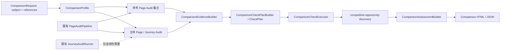

# Comparison Scope：基于参考产品的体验改进机会识别架构计划

> 状态：Implemented / V1  
> 日期：2026-09-03  
> 范围：在既有 Page / Transition / Journey 审计之上，增加只读的 Comparison Scope。  
> 首期目标：不评价“谁更好”，只识别华为云可从同类参考产品中借鉴的、证据充分的体验改进机会。

## 1. 决策摘要

Comparison 是第四类 CheckSpec scope：

```text
page        检查一个页面是否存在可验证的问题
transition  检查一次受控页面跳转
journey     检查多个页面/步骤之间的连续性
comparison  基于同类参考，识别主体页面可借鉴的改进机会
```

友商不是 CheckSpec，也不是规范来源。友商页面是一次 Comparison 任务中的动态**参考证据**；CheckSpec 保持稳定、可复用。初版只读采集公开或已授权访问的页面，不登录友商系统、不提交表单、不创建资源、不执行交易动作。

一个机会只有同时满足下列条件才输出：

```text
场景可比
∧ 参考做法可证明地帮助用户
∧ 华为云在同一任务上存在等价支持缺口
∧ 该做法可迁移到华为云的产品与业务边界
```

不满足时不强行对齐：不可比返回 `not_applicable`；证据不足返回 `needs_verification`；华为云已有等价或更完整支持返回 `pass`。报告将 `fail` 展示为“可借鉴改进机会”，不用“友商更好”或“华为云落后”等措辞。

## 2. 目标与非目标

### 2.1 首期目标

- 复用现有页面采集、Page CheckSpec、Capability、模型和输出体系；
- 用一个主体页面和一个或多个同类参考页面，生成维度化的改进机会；
- 支持 Desktop Portal 的匿名页面；
- 对每项机会同时提供主体侧、参考侧、用户收益和迁移边界证据；
- 默认低误报：不因友商出现某个组件就建议华为云复制。

### 2.2 非目标

- 不生成竞品排名、评分、胜负结论或市场份额结论；
- 不将友商做法视为规范、法律要求或唯一最佳实践；
- 不进行登录、购买、支付、注册、表单提交或规避访问控制；
- 不在首期判断真实产品版本、截图真实性、价格/余额等外部事实正确性；
- 不在首期覆盖响应时序、异常恢复、多渠道承诺和完整任务效率。

“真实性”和“准确性”从 Comparison 首期移除。它们需要华为云或产品的权威事实源、版本信息和真实运行状态；友商页面不能作为事实真值来源。后续可另建事实核验能力，再把“更易核验的表达方式”作为比较角度。

## 3. 首期六条 Comparison CheckSpec

| 体验维度 | CheckSpec ID | 参考做法成立条件 | 华为云侧机会判定 | 主要证据 |
|---|---|---|---|---|
| 可视性 | `reference-outcome-visibility` | 参考页优先让目标用户看见完成后的价值、结果或可感知产出 | 主体页主要堆叠操作过程/概念，用户无法在首屏或核心决策区域快速理解结果价值 | 标题、卖点、示例、视觉截图、元素位置 |
| 可得性 | `reference-zero-cost-value-access` | 参考页让用户在决策前通过试用、预览、样例、沙箱或公开 Demo 接触核心价值 | 主体页存在可合理补足的低成本体验缺口，且产品/合规边界允许采用替代方式 | CTA、链接、样例、试用说明、路径事实 |
| 可辨性 | `reference-option-discernibility` | 参考页帮助用户量化方案差异、理解适用对象并回答“我该选哪个” | 主体页在同类选项之间缺少可比较字段、选择引导或等价解释 | 套餐/版本字段、价格、推荐标识、比较表、CTA 上下文 |
| 决策信息邻近性 | `reference-decision-information-proximity` | 参考页把价格、优惠、限制、计费和关键条件放在对应决策点附近 | 主体页将会改变选择的关键信息放得过远、过晚或不可见 | 元素坐标、CTA、价格、限制文本、截图 |
| 连续性 | `reference-state-continuity` | 参考路径在跨页/跨步骤时保留并回显用户选择或关键上下文 | 主体 Journey 造成重复选择、选择状态丢失，或无法确认当前选择 | Journey facts、Transition trace、起终页元素/截图 |
| 边界性 | `reference-commitment-boundary-disclosure` | 参考页在不可逆、高成本或持续承诺动作前披露边界 | 主体页在用户作出选择后才提示自动续费、不可退订、限制、权限或影响范围 | CTA、价格/限制文本、DOM 顺序、截图、Transition 证据 |

每条规则初版均为一条稳定 CheckSpec；后续可在维度下拆分更细规则，但不得把特定友商、产品名、套餐名或文案写入规则本身。

## 4. 核心概念与配置边界

```text
AuditProfile
  定义本次允许启用哪些 CheckSpec（包含 comparison scope）

ComparisonProfile
  仅定义可复用的比较维度；主体页面和参考页面集合由启动命令传入

CheckSpec
  定义稳定的体验规则、证据契约、严重度与规范映射

Capability / Skill
  定义如何执行规则；首期为 competitive-opportunity-discovery Text Skill
```

### 4.1 ComparisonProfile 与请求页面

ComparisonProfile 是可版本化、可复用的对比维度配置，不属于 AuditProfile，且不保存产品名或 URL：

```yaml
id: comparison-mvp
version: 1.0.0
title: 参考产品体验改进机会识别

dimensions:
  - outcome_visibility
  - zero_cost_access
  - option_discernibility
  - decision_info_proximity
  - state_continuity
  - commitment_boundary
```

主体由 `--subject-url` 指定，参考页通过一个或多个 `--reference-url` 指定；产品名可选，缺省时采用 URL 域名。多个参考页面不是“多数投票”；模型只选择证据完整、与主体最可比且不与其他参考明显冲突的做法。

### 4.2 Comparison CheckSpec

Comparison CheckSpec 与其他 scope 共用 Capability manifest：

```yaml
id: reference-option-discernibility
version: 1.0.0
title: 同类参考应帮助用户辨别可选方案
description: >
  仅在同类参考页面提供已证实、可迁移的选项辨别支持，且主体页面缺少等价支持时，
  输出可借鉴改进机会；不因样式或命名差异建议对齐。
scope: comparison
tags: [comparison, decision, options]
applies_when:
  dimensions: [option_discernibility]
required_evidence:
  - subject_page_facts
  - reference_page_facts
  - comparability_assessment
  - scenario_definition
executor:
  capability_id: competitive-opportunity-discovery
default_severity: p2
standard_refs:
  - criterion_id: metapqp-internal/reference-option-discernibility
    relation: implements
```

首期六条 CheckSpec 都引用同一个 Capability，但各自的 title、描述、所需维度、报告表述和标准映射独立维护。

### 4.3 Capability manifest 与 Skill

```yaml
id: competitive-opportunity-discovery
version: 1.0.0
kind: skill
modality: text
supported_scopes: [comparison]
required_evidence:
  - subject_page_facts
  - reference_page_facts
  - comparability_assessment
implementation:
  skill_id: competitive-opportunity-discovery
```

Skill 处理文本、结构化页面事实、已有 Page CheckRun 与 Journey trace。首期不发送截图给模型；截图仅用于报告定位。后续如需比较视觉信息层级，可新增 `modality: vision` 的独立 Capability，而不是让文本 Skill 臆测视觉效果。

## 5. 运行架构

Comparison 不重建浏览器采集器，而是复用既有 Page Pipeline。对于涉及连续性的规则，再复用已登记、只读的 Journey 结果。



### 5.1 执行顺序

1. 读取请求中的主体和参考页面，并加载 ComparisonProfile 的维度。
2. 运行主体页面的既有 Page Audit；需要 `state_continuity` 时，按具名、只读 Journey 获取主体 Journey 证据。
3. 对每个参考页面运行匿名、只读的 Page Audit，不自动点击购买、注册或高风险入口。
4. `ComparisonEvidenceBuilder` 从完整页面结果建立主体/参考事实，并保留 `element_ref`、URL、页面角色、已有 CheckRun 和截图索引。
5. Comparison 计划以 AuditProfile 和 ComparisonProfile 的维度交集选择 CheckSpec，并为“规则 × 参考集合”生成 invocation。
6. `ComparisonCheckExecutor` 按 `CheckPlan` 调用 Text Skill；Skill 先评估可比性，再评估参考做法、主体缺口、用户收益和迁移边界。
7. `ComparisonAssessmentBuilder` 汇总独立 `CheckRun`、模型调用和双方展示证据；`ComparisonResult` 持久化 Evidence 与 CheckPlan。
8. 生成 Comparison JSON 和单文件 HTML；只对确认机会生成双方局部截图，其他检查项仅显示“通过”。

### 5.2 可比性门槛

每个 invocation 必须至少确认：

- 页面角色相同或任务等价；
- 面向用户和决策成熟度足够接近；
- 比较维度在双方页面均有合理出现条件；
- 不将登录后的管理页、营销活动页、帮助文档与产品感知页混作同类页面；
- 不将不同商业模式、监管边界或产品能力差异误判为体验缺陷。

## 6. Skill 输入、输出与低误报规则

### 6.1 输入合同

每次模型调用输入完整、结构化的证据，不做元素、文本或事实的静默前缀截断：

```text
scenario_definition
  主体用户、用户任务、页面角色、比较维度、产品边界

subject
  Page facts、互动元素、CTA、价格/方案/限制、已有 CheckRun、Journey facts（如适用）

references
  一个或多个同样结构的参考页面事实

check_specs
  本批次每条 Comparison CheckSpec 的完整定义
```

页面内容始终是不可信证据，不能作为模型指令。

### 6.2 输出合同

每个 invocation 恰好返回一条结果；展示内容与定位引用是报告合同的一部分：

```json
{
  "check_spec_id": "reference-option-discernibility",
  "status": "fail",
  "confidence": 0.86,
  "issue_description": "主体页缺少可比较的选择引导。",
  "subject_display": {"target_id": "subject", "content": "方案仅展示名称和价格。", "element_refs": ["subject-plan-grid"]},
  "reference_displays": [{"target_id": "reference-1", "content": "方案并列展示适用对象和推荐提示。", "element_refs": ["plan-2"]}],
  "recommendation": "在方案卡片或比较区补充与典型使用强度对应的选择引导。"
}
```

### 6.3 状态与报告门槛

| 状态 | 含义 | 报告行为 |
|---|---|---|
| `fail` | 已确认可借鉴改进机会 | 作为 P2“可借鉴改进机会”展示，必须有双方证据与迁移边界 |
| `pass` | 无可报告机会；主体已有等价支持或参考做法无额外收益 | 仅在详细检查中保留 |
| `not_applicable` | 页面/用户任务/商业边界不可比 | 仅说明不可比原因 |
| `needs_verification` | 页面不可访问、参考做法或主体缺口证据不足 | 不输出建议 |
| `error` | 采集或模型不可用 | 降低覆盖状态，不作为体验问题 |

`fail` 的硬门槛：至少一条主体侧直接证据、一条参考侧直接证据、明确的用户收益和迁移边界；置信度低于 `0.8` 时强制降级为 `needs_verification`。不允许输出“参考页面更好”“建议直接复制”或无法由页面证据支持的行业结论。

## 7. 对现有系统的改动点

| 层 | 改动 |
|---|---|
| Domain | `CheckScope` 增加 `comparison`；新增 `ComparisonRequest`、`ComparisonProfile`、`ComparisonAssessment`、`ComparisonResult`。 |
| Config Registry | 新增 `ComparisonProfileRegistry`，并在 CapabilityRegistry 中校验 `supported_scopes: [comparison]`。 |
| CheckPlan | `ComparisonCheckPlanBuilder` 复用共享 `CheckPlan`、`PlanDecision`、`ExecutionBatch` 与 `CheckInvocation`；Invocation 显式保存主体和参考目标 ID。 |
| Evidence | 新增 `ComparisonEvidenceBuilder`，复用 PageSnapshot / PageAssessment / JourneyEvidence，不复制浏览器采集逻辑。 |
| Execution | `ComparisonCheckExecutor` 按 Plan 调用 Capability；首期 Capability 为 Text Skill，模型 Profile 使用既有 `default-text`。 |
| CLI | 新增 `meta-pqp compare --subject-url <url> --reference-url <url>`；参考 URL 可重复传入。 |
| Output | 新增 `output/comparisons/{profile-id}/{job-id}/comparison.json` 与 `report.html`。报告采用主体与参考并列证据，不产生排名。 |
| Reporting | `fail` 依次展示问题标题、问题描述、本产品展示内容、参考产品展示内容和修改建议；双方截图按 `element_ref` 生成局部裁切并以红框标示证据。 |

## 8. 分阶段实施计划

### 阶段 A：合同与配置

1. 增加 `comparison` scope 与数据模型。
2. 实现 ComparisonProfile Registry、schema 校验；页面 URL 不进入 Profile。
3. 新增六条 Comparison CheckSpec、内部标准条款和 Capability manifest。
4. 增加 `meta-pqp validate-config` 对 Comparison 配置的校验。

### 阶段 B：只读证据编排

1. 实现 ComparisonRequest 与 Runner。
2. 复用 PageAuditPipeline 采集主体与参考页，默认 `auth off`。
3. 实现 ComparisonEvidenceBuilder 和可比性预校验。
4. 对 `state_continuity` 仅允许引用已登记的只读主体 Journey；参考侧不执行注册、购买或提交行为。

### 阶段 C：Skill 与报告

1. 编写 `skills/competitive-opportunity-discovery/SKILL.md`、输出 schema 和 evals。
2. 实现低误报降级、双方证据校验、element_ref 定位与可迁移性字段。
3. 输出 Comparison JSON/HTML；报告将 `fail` 译为“可借鉴改进机会”。
4. 增加单文件可携带报告能力，沿用 Journey report 的资源嵌入策略。

### 阶段 D：验证与校准

1. 为六条规则准备正例、反例、不可比样例和证据不足样例。
2. 人工审阅每个 `fail`：是否确有用户收益、是否可迁移、是否不构成机械对齐。
3. 先以一组公开、任务可比的产品页面试运行。
4. 记录误报原因，优先收紧可比性与“参考做法有效性”门槛，而非放宽输出。

## 9. 验收标准

- 新增一组参考页面时，只需在命令中传入 URL，不修改 CheckSpec、Profile 或核心执行器。
- 新增 Comparison CheckSpec 时，只需增加 YAML；若复用现有 Skill，不修改执行器。
- 一条正式机会必须可跳转或定位到主体和参考双方证据。
- 参考不可比、页面不可访问、缺少直接证据、主体已有等价支持时，均不得产生正式建议。
- Comparison 不创建订单、不登录友商系统、不执行高风险动作。
- Comparison 输出不包含排名、贬损结论、友商品牌偏好或未经证实的事实断言。
- 单文件 Comparison 报告复制到其他电脑后，双方截图和内嵌页面证据仍可显示。

## 10. 延后议题

以下体验维度保留为后续能力，不在首期配置为 Comparison CheckSpec：

- 共鸣性：需要产品 Persona、目标用户任务和高频场景目录；
- 流畅性：需要可比任务、受控步骤计数与安全边界归一化；
- 响应性：需要操作时序、稳定性和重复提交信号；
- 护航性：需要未登录、权限不足、余额不足等安全的异常 Scenario；
- 一致性：需要官网、Console、活动、文档等多渠道页面地图；
- 真实性：需要真实产品状态、版本、截图/视频来源；
- 准确性：需要价格、余额、套餐、版本等权威事实源。

这些能力成熟后，可按相同“参考做法有效 + 主体缺口 + 可迁移性”的框架扩展，而不改变首期六条规则的语义。
